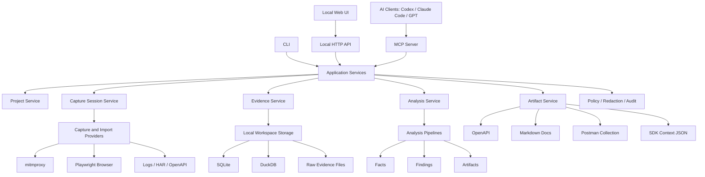

# 软件分析 MCP 平台项目计划

## 1. 项目定位与边界

### 1.1 项目愿景

本项目目标是构建一个面向 AI 编程工具的软件分析平台。它不是聊天机器人，也不是单一抓包脚本，而是一个可以被 Codex、Claude Code、GPT、其他 Agent 或自动化系统复用的专业分析基础设施。

平台的核心价值是：把网站/API、抓包、日志、浏览器行为和其他运行时证据，转换为稳定、结构化、可追溯的软件知识。AI 不再只依赖模型自身推理，而是通过 MCP 工具调用获得可验证的分析结果。

长期目标是形成一个开源的软件分析工具平台，具备以下能力：

- 在线采集网站/API 流量。
- 分析 HTTP 请求、响应、认证、参数、Schema、错误码和数据模型。
- 关联抓包、日志、浏览器操作轨迹和数据库结构。
- 推断操作流程、业务实体和实体状态变化。
- 生成 OpenAPI、Markdown API 文档、Postman Collection 和 SDK 生成上下文。
- 以 MCP 为核心接口，为不同 AI 工具提供统一、结构化、可追溯的数据。
- 通过插件机制接入 mitmproxy、Playwright、Frida、Ghidra、数据库 introspector、日志解析器等外部工具。

### 1.2 第一阶段主战场

第一阶段不以 EXE、DLL、APK、JAR 等二进制或应用包分析为核心，而是优先聚焦：

- 网站/API 分析。
- 在线抓包代理。
- HTTP/HTTPS 请求响应采集。
- 抓包与日志分析。
- 浏览器操作轨迹采集。
- OpenAPI/API 文档生成。
- L2 操作流程理解。
- L3 业务实体与状态理解。

EXE、DLL、APK、JAR、Frida、Ghidra 等能力作为后续扩展方向接入，不进入 V1 核心范围。

### 1.3 产品不是 Agent，而是工具平台

本项目的核心形态是插件/MCP 平台，而不是一个特定 Agent。

它应该被设计为：

- 可被 Codex 调用。
- 可被 Claude Code 调用。
- 可被 ChatGPT/GPT 工具系统调用。
- 可被本地 CLI、CI、Web UI 或其他自动化系统调用。
- 可作为独立开源项目运行和扩展。

因此平台不应该把业务逻辑写进某个 Agent prompt，也不应该依赖某个模型供应商的私有能力。模型可以作为可选增强层，但平台本体必须提供确定性分析、结构化存储、证据追溯和可复现管线。

### 1.4 核心设计原则

项目应遵循以下原则：

- MCP 优先：AI 主要通过 MCP 工具访问平台能力。
- Local-first：第一阶段以本地项目工作区运行，不强依赖云服务。
- Team-ready：第一阶段不做完整团队协作，但数据模型预留 workspace、user、role、audit 等概念。
- Evidence-first：任何结论都应能追溯到原始证据或脱敏证据。
- Redaction by default：AI 默认只能看到脱敏后的证据、事实、结论和产物。
- Pipeline-oriented：平台核心不是一堆工具胶水，而是 Evidence -> Facts -> Findings -> Artifacts 的分析管线。
- Provider-based integration：外部工具通过 Provider 接口接入，例如 mitmproxy、Playwright、日志源、数据库源。
- Deterministic first, LLM-assisted：确定性分析为主，LLM 作为可插拔增强层。
- Structured outputs：MCP 返回 JSON Schema 可描述的结构化结果，而不是大段不可验证文本。
- Open source maintainability：架构、目录、测试、文档、插件机制都要按长期维护项目设计。

### 1.5 第一阶段明确包含的能力

V1 应包含以下能力：

- 创建和打开本地分析项目。
- 启动和停止在线抓包会话。
- 通过 mitmproxy 采集 HTTP/HTTPS 请求响应。
- 通过 Playwright 采集浏览器页面、点击、表单和 network 相关线索。
- 将抓包 flow、浏览器事件和日志统一写入 evidence store。
- 对请求响应进行脱敏、归一化和索引。
- 提取 endpoint inventory。
- 推断 request schema、response schema、认证方式和错误响应。
- 生成 OpenAPI 3.1。
- 生成 Markdown API 文档。
- 生成 Postman Collection。
- 生成 SDK generation context JSON。
- 推断 L2 操作流程。
- 推断 L3 业务实体、实体关系和状态变化。
- 记录 MCP 调用、导出行为和 LLM enrich 行为的审计日志。

### 1.6 第一阶段明确不承诺的能力

V1 不承诺以下能力：

- 完整理解所有业务规则。
- 自动破解或绕过复杂认证。
- 自动发现所有隐藏接口。
- 自动生成生产可用 SDK。
- 自动做漏洞扫描。
- 完整替代 Burp、Postman、Datadog、OpenTelemetry 或 API Gateway。
- 完整多租户 SaaS。
- 原生自研 HTTPS 代理。
- EXE、DLL、APK、JAR 的深度逆向分析。

这些能力可以作为后续版本方向，但不应影响第一阶段核心平台的稳定落地。

### 1.7 已确认的关键架构决策

当前已经确认的关键决策如下：

| 决策项 | 结论 |
| --- | --- |
| 核心形态 | MCP 平台，不是 Agent |
| 第一主战场 | 网站/API、在线抓包、日志分析 |
| 采集方式 | 第一阶段编排 mitmproxy，不自研完整代理 |
| 浏览器证据 | Playwright/browser trace 是一等证据源 |
| 存储模式 | 本地项目工作区 + SQLite/DuckDB + 原始 evidence 文件 |
| 分析模型 | Evidence -> Facts -> Findings -> Artifacts |
| 扩展机制 | Provider + Pipeline 双扩展点 |
| 实现语言 | TypeScript 主干 + Python worker |
| LLM 使用 | 可选辅助推断，不污染原始证据层 |
| 安全策略 | 默认脱敏、访问策略、审计日志从 V1 开始内置 |
| V1 业务理解目标 | L2 稳定可用，L3 作为差异化核心，L4 只做候选发现 |
| 导出产物 | OpenAPI 3.1、Markdown 文档、Postman Collection、SDK context JSON |

### 1.8 推荐的一句话定位

> 一个面向 AI 工具的软件分析 MCP 平台，用在线抓包、浏览器轨迹和日志证据自动构建可追溯的 API、流程、业务实体和状态模型，并导出 OpenAPI、文档和 SDK 生成上下文。

## 2. 总体架构设计

### 2.1 架构总览

平台采用分层架构。最外层面向 AI、CLI 和 Web UI 暴露能力；中间层负责编排项目、采集、存储、分析和导出；底层通过 Provider 与 Worker 接入外部工具和重分析任务。

推荐总体结构如下：

```text
AI Clients
  - Codex
  - Claude Code
  - GPT / ChatGPT
  - Other MCP-compatible tools

Interfaces
  - MCP Server
  - CLI
  - Local Web UI
  - Local HTTP API

Application Services
  - Project Service
  - Capture Session Service
  - Evidence Service
  - Analysis Service
  - Artifact Service
  - Policy / Redaction Service
  - Audit Service

Core Domain
  - Evidence
  - Facts
  - Findings
  - Artifacts
  - Pipelines
  - Providers

Storage
  - Local workspace files
  - SQLite
  - DuckDB
  - Raw evidence archive

Providers and Workers
  - mitmproxy provider
  - Playwright provider
  - log import provider
  - database schema provider
  - Python analysis worker
  - future: Frida / Ghidra / pcap providers
```

### 2.2 核心运行链路

典型在线分析流程如下：

```text
1. 用户或 AI 创建 Project
2. MCP/CLI 启动 Capture Session
3. Capture Orchestrator 启动 mitmproxy
4. 可选启动 Playwright browser-assisted session
5. 用户在浏览器或目标客户端中操作系统
6. mitmproxy 捕获 HTTP/HTTPS flows
7. Playwright 捕获页面、点击、表单、导航和 network 线索
8. Evidence Service 写入 raw evidence 和 normalized evidence
9. Redaction Engine 生成 AI-safe evidence view
10. Analysis Pipeline 提取 Facts
11. Workflow Intelligence 推断 L2/L3 Findings
12. Exporter 生成 OpenAPI、Markdown、Postman、SDK context
13. MCP 工具向 AI 返回结构化结果和 evidence_refs
```

这个链路的关键点是：采集、分析和导出不是一次性报告生成，而是可重复运行的 pipeline。每次 pipeline 运行都应该产生 pipeline run id，便于复现、审计和调试。

### 2.3 分层职责

#### 2.3.1 Interface Layer

Interface Layer 面向外部调用者，包含 MCP Server、CLI、本地 Web UI 和本地 HTTP API。

职责：

- 将外部请求转换为应用服务调用。
- 校验参数和项目上下文。
- 执行访问策略。
- 将内部结果转换为稳定的结构化输出。
- 对 MCP 调用写入审计日志。

MCP Server 是首要接口。CLI 和 Web UI 不应该绕过核心服务直接访问底层数据，否则会导致行为不一致。

#### 2.3.2 Application Service Layer

Application Service Layer 是平台的编排层，不直接实现复杂算法，而是协调 domain、storage、provider 和 pipeline。

核心服务：

- Project Service：创建、打开、校验项目工作区。
- Capture Session Service：管理采集会话生命周期。
- Evidence Service：写入、索引、查询证据。
- Analysis Service：运行分析 pipeline，查询 facts/findings。
- Artifact Service：生成、版本化和导出 artifacts。
- Policy Service：访问控制和数据暴露策略。
- Redaction Service：脱敏规则配置和执行。
- Audit Service：记录 MCP、CLI、Web UI 和导出行为。

这一层应该尽量保持可测试，不与具体 mitmproxy、Playwright、SQLite 驱动深度耦合。

#### 2.3.3 Core Domain Layer

Core Domain Layer 定义项目最重要的抽象：

- Project
- CaptureSession
- EvidenceSource
- Evidence
- Fact
- Finding
- Artifact
- Pipeline
- Provider
- RedactionPolicy
- AuditEvent

这一层应尽量不依赖外部框架，便于长期维护和测试。

#### 2.3.4 Provider Layer

Provider Layer 负责接入外部工具或数据源。

V1 Provider：

- MitmproxyCaptureProvider
- PlaywrightBrowserProvider
- HarImportProvider
- LogImportProvider
- OpenApiImportProvider

后续 Provider：

- DatabaseSchemaProvider
- PcapProvider
- FridaProvider
- GhidraProvider
- AndroidAdbProvider
- SeleniumProvider
- OpenTelemetryProvider

Provider 的职责是产生 Evidence，不应该直接写死业务分析结论。业务分析应该由 pipeline 完成。

#### 2.3.5 Pipeline Layer

Pipeline Layer 是平台的分析核心。

它负责把 evidence 转换为 facts、findings 和 artifacts：

```text
Evidence
  -> Normalized Evidence
  -> Facts
  -> Findings
  -> Artifacts
```

典型 pipeline：

- normalize_http_traffic
- redact_sensitive_data
- infer_endpoint_inventory
- infer_http_schemas
- infer_auth_schemes
- correlate_browser_events
- correlate_logs_with_requests
- infer_workflows
- infer_business_entities
- infer_entity_state_transitions
- enrich_findings_with_llm
- generate_openapi
- generate_markdown_docs
- generate_postman_collection
- generate_sdk_context

Pipeline 应支持：

- 可单独运行。
- 可组合运行。
- 有输入、输出和版本。
- 有 pipeline_run_id。
- 有 evidence_refs。
- 可缓存结果。
- 可重新运行并比较结果变化。

#### 2.3.6 Storage Layer

Storage Layer 负责持久化项目数据。

V1 推荐：

- SQLite：存储实体关系、项目元数据、endpoint、schema、workflow、finding、artifact、audit event。
- DuckDB：存储请求统计、日志表、字段分布、时间序列、批量分析结果。
- 文件系统：存储 raw evidence、normalized evidence、导出产物、pipeline run artifacts。

Storage Layer 应通过接口访问，避免业务层直接绑定 SQLite 文件路径。

#### 2.3.7 Worker Layer

Worker Layer 运行重任务和外部工具适配逻辑。

推荐分工：

- TypeScript 主进程负责编排、MCP、CLI、Web UI、本地 API、核心数据模型。
- Python worker 负责 mitmproxy addon、部分日志解析、统计分析和后续工具集成。

第一阶段通信方式建议使用 NDJSON 或 JSON-RPC over stdio：

```text
TypeScript parent process
  -> spawn Python worker
  -> send JSON-RPC request
  -> receive JSON-RPC response/event
```

后续可以演进为：

- Unix socket。
- Local HTTP。
- gRPC。
- Remote worker。

### 2.4 核心架构图



### 2.5 为什么采用 Local-first 架构

第一阶段采用 Local-first，不是因为团队场景不重要，而是因为当前目标更适合先本地跑通：

- Codex 和 Claude Code 主要工作在本地项目上下文中。
- 抓包和浏览器采集往往涉及本地证书、端口和代理配置。
- 开源用户更容易安装、试用和调试。
- 敏感数据不默认离开本机。
- SQLite、DuckDB 和文件系统足以支撑 V1 分析规模。
- 后续演进为团队版时，StorageProvider 和 AuditEvent 模型可以复用。

Local-first 不等于单文件脚本。它仍然需要清晰的 workspace、project、storage、policy 和 audit 边界。

### 2.6 为什么不直接做 SaaS 或中心化服务

第一阶段不建议直接做 SaaS，原因如下：

- 在线抓包涉及隐私和敏感 token，云端存储会提高合规门槛。
- 多租户、账号、权限、审计、计费会分散核心研发精力。
- 代理证书安装和流量采集更适合先在本地验证。
- 开源项目需要先证明本地核心能力，而不是先搭运营平台。

但架构不应该堵死 SaaS 化：

- Project 应属于 Workspace。
- AuditEvent 应记录 caller 和 source。
- StorageProvider 应可替换。
- Artifact 应有版本。
- RedactionPolicy 应可配置和导出。
- MCP tool 应支持明确 project_id 或当前 project context。

### 2.7 为什么第一阶段编排 mitmproxy

平台第一阶段不自研完整 HTTP/HTTPS 代理，而是编排 mitmproxy。

原因：

- mitmproxy 已经成熟处理 HTTPS、证书、代理、flow dump、WebSocket 和脚本扩展。
- 平台真正差异化在证据建模、分析管线和 AI 可消费接口，不在重写代理底层。
- 通过 CaptureProvider 抽象，未来仍可替换或补充自研代理。
- mitmproxy addon 可以将 flow 实时传给平台，也可以保存后批量导入。

平台对 mitmproxy 的依赖应被封装在 Provider 中：

```text
MitmproxyCaptureProvider
  - start(session_config)
  - stop(session_id)
  - get_status(session_id)
  - stream_events(session_id)
  - import_dump(file)
```

上层服务不应该直接感知 mitmproxy 命令行参数和 dump 格式。

### 2.8 为什么 Playwright 是一等证据源

仅靠 HTTP 抓包很难准确推断用户意图和业务动作。Playwright 提供浏览器上下文，可以补齐语义线索。

Playwright 证据包括：

- 页面 URL。
- 页面标题。
- DOM 关键文本。
- 点击元素文本。
- 表单字段 label、name、placeholder。
- navigation event。
- network request 与 browser action 的时间关联。
- screenshot 或 trace 文件。

这些证据可以帮助平台从 HTTP flow 推断业务动作：

```text
点击“提交审批”
  -> POST /api/items/123/action
  -> response.status = approved
  -> 推断 workflow step = submit approval
  -> 推断 entity transition = Approval.pending -> Approval.approved
```

因此 V1 应支持两种采集模式：

- Proxy-only Capture：只使用 mitmproxy，适合非浏览器客户端和已有流量。
- Browser-assisted Capture：Playwright 启动浏览器并走 mitmproxy，适合网站/API 分析和 L3 业务理解。

### 2.9 运行形态

第一阶段推荐提供三种运行形态：

#### MCP Server

面向 AI 工具：

```text
software-analysis-mcp serve --project ./analysis-workspace
```

#### CLI

面向开发者、CI 和调试：

```text
software-analysis init ./analysis-workspace
software-analysis capture start --browser
software-analysis analyze api
software-analysis export openapi
```

#### Local Web UI

面向人类审查：

```text
software-analysis ui --project ./analysis-workspace
```

Web UI 第一阶段只做轻量审查和配置，不把产品重心转移到 UI。

### 2.10 架构边界总结

总体架构的关键边界如下：

- MCP/CLI/Web UI 都调用 Application Services。
- Application Services 编排 Provider、Storage 和 Pipeline。
- Provider 只负责产生或导入 Evidence。
- Pipeline 负责从 Evidence 生成 Facts、Findings 和 Artifacts。
- Storage 通过接口访问，默认 LocalWorkspaceStorage。
- LLM 只能作为 Pipeline 中的 enrich 阶段，不能修改 raw evidence。
- AI 默认只能读取脱敏视图。
- 所有高层结论必须带 evidence_refs 和 confidence。

## 3. 技术选型与工程栈

### 3.1 总体技术路线

推荐采用 TypeScript 作为平台主干，Python 作为采集与分析 worker。

```text
TypeScript:
  - MCP Server
  - CLI
  - Local HTTP API
  - Web UI backend integration
  - Core domain model
  - Pipeline orchestration
  - Storage interface
  - OpenAPI / JSON Schema / artifact generation

Python:
  - mitmproxy addon
  - traffic parser worker
  - log parser worker
  - statistical analysis worker
  - future Frida / Ghidra / binary tooling integration
```

这个组合兼顾 MCP 和 Web 工程生态，也保留 Python 在抓包、日志、数据分析和安全工具生态中的优势。

### 3.2 TypeScript 主干

TypeScript 主干建议使用 Node.js 运行时。

推荐选择：

| 领域 | 推荐技术 |
| --- | --- |
| 语言 | TypeScript |
| 运行时 | Node.js LTS |
| 包管理 | pnpm |
| Monorepo | pnpm workspaces |
| 构建 | tsup 或 unbuild |
| 测试 | Vitest |
| 校验 | TypeScript strict mode |
| 格式化 | Prettier |
| Lint | ESLint |
| Schema | Zod |
| CLI | Commander.js 或 Clipanion |
| MCP | 官方 MCP TypeScript SDK |
| 本地 API | Fastify |
| 日志 | pino |
| 配置 | YAML + Zod validation |

TypeScript 层应是平台的稳定主控层。所有外部接口、MCP tool schema、项目配置、artifact schema、pipeline manifest 都应由 TypeScript 定义和校验。

### 3.3 Python Worker

Python worker 用于处理 TypeScript 生态不擅长或外部工具天然属于 Python 的部分。

推荐选择：

| 领域 | 推荐技术 |
| --- | --- |
| 语言 | Python 3.11+ |
| 包管理 | uv |
| 抓包 | mitmproxy |
| 数据处理 | orjson、pydantic |
| 日志解析 | 自研 parser + 可选 lark/pyparsing |
| 统计分析 | pandas 可选，优先避免作为核心依赖 |
| JSON Schema 辅助 | genson 或自研 schema merger |
| 测试 | pytest |
| 类型 | pyright 或 mypy |
| 通信 | JSON-RPC/NDJSON over stdio |

Python worker 不应该直接拥有项目主状态。它应作为可替换 worker 接收任务、返回结构化结果。

推荐 worker 输入输出模式：

```json
{
  "jsonrpc": "2.0",
  "id": "req_123",
  "method": "analyze_http_flows",
  "params": {
    "project_id": "proj_abc",
    "flow_refs": ["flow_1", "flow_2"],
    "options": {
      "redacted": true
    }
  }
}
```

```json
{
  "jsonrpc": "2.0",
  "id": "req_123",
  "result": {
    "facts": [],
    "warnings": [],
    "metrics": {}
  }
}
```

### 3.4 MCP 技术选型

MCP Server 是平台首要接口。

推荐使用官方 MCP TypeScript SDK，并为每个 tool 定义稳定 schema。

MCP 设计原则：

- 每个 tool 输入输出都使用 Zod 或 JSON Schema 严格定义。
- tool 返回结果必须结构化。
- 高层 tool 必须返回 confidence、evidence_refs 和 pipeline_run_id。
- 所有 tool 调用写入 AuditEvent。
- 默认返回脱敏视图。
- 允许 AI 进行低层证据查询，但避免一次返回过大 payload。
- 大结果使用分页、游标或 artifact 引用。

MCP Server 不应直接执行复杂逻辑，而应调用 Application Services。

推荐 MCP 入口包：

```text
packages/mcp
  src/server.ts
  src/tools/project.tools.ts
  src/tools/capture.tools.ts
  src/tools/evidence.tools.ts
  src/tools/analysis.tools.ts
  src/tools/export.tools.ts
  src/tools/policy.tools.ts
```

### 3.5 本地 HTTP API

本地 HTTP API 主要服务 Web UI，也可以用于调试和未来集成。

推荐使用 Fastify：

- 性能稳定。
- TypeScript 支持好。
- Schema 驱动。
- 插件生态成熟。
- 适合本地服务和未来远程服务演进。

HTTP API 不应成为 MCP 的替代实现。它和 MCP 应共享 Application Services。

推荐 API 范围：

```text
GET    /projects/current
GET    /capture/sessions
POST   /capture/sessions
POST   /capture/sessions/:id/stop
GET    /traffic/requests
GET    /traffic/requests/:id
GET    /analysis/endpoints
GET    /analysis/workflows
GET    /analysis/entities
POST   /analysis/pipelines/:name/run
GET    /artifacts
GET    /artifacts/:id
GET    /policy/redaction
PUT    /policy/redaction
```

### 3.6 Web UI 技术选型

Web UI 第一阶段应轻量，但工程上要可维护。

推荐选择：

| 领域 | 推荐技术 |
| --- | --- |
| 框架 | React |
| 构建 | Vite |
| 语言 | TypeScript |
| 样式 | Tailwind CSS 或 CSS Modules |
| 数据请求 | TanStack Query |
| 表格 | TanStack Table |
| 状态图/流程图 | Mermaid 或 React Flow |
| JSON 查看 | react-json-view-lite 或自研简化组件 |

Web UI 第一阶段页面：

- Project overview。
- Capture sessions。
- Request search。
- Request/response detail。
- Endpoint inventory。
- Workflow view。
- Entity/state view。
- Artifact exports。
- Redaction policy。

Web UI 不应承担核心分析逻辑，只负责审查、配置和导出。

### 3.7 存储技术选型

V1 推荐使用本地混合存储：

| 数据类型 | 存储 |
| --- | --- |
| 项目元数据 | YAML + SQLite |
| 实体关系 | SQLite |
| endpoint/fact/finding | SQLite |
| 审计日志 | SQLite |
| 大量请求统计 | DuckDB |
| 日志分析表 | DuckDB |
| 原始抓包 | 文件系统 |
| 原始日志 | 文件系统 |
| normalized evidence | JSONL/Parquet 可选 |
| 导出产物 | 文件系统 |

SQLite 适合关系型查询和事务；DuckDB 适合分析型查询和大批量聚合。两者在本地工具平台中非常合适。

推荐数据库访问：

| 领域 | 推荐 |
| --- | --- |
| SQLite driver | better-sqlite3 |
| SQLite migration | drizzle-kit 或自研 migrations |
| Query builder | Drizzle ORM 或 Kysely |
| DuckDB driver | duckdb-node 生态中选择维护活跃者 |

如果 DuckDB Node 生态不稳定，V1 可以先通过 Python worker 执行 DuckDB 分析任务，TypeScript 只读取结果。

### 3.8 原始证据文件格式

Raw evidence 必须尽量保留原始形态，同时生成 normalized view。

推荐：

```text
HTTP flows:
  - raw mitmproxy dump
  - normalized JSONL
  - body blob files for large payloads

Browser trace:
  - Playwright trace.zip
  - browser events JSONL
  - optional screenshots

Logs:
  - raw log files
  - parsed JSONL
  - DuckDB imported table

Artifacts:
  - OpenAPI YAML/JSON
  - Markdown
  - Postman JSON
  - SDK context JSON
```

大型 body 不建议直接塞入 SQLite。应存文件，并在数据库中保存 blob_ref、hash、mime_type、size、redaction_status。

### 3.9 JSON Schema 与 OpenAPI

平台会大量处理 Schema，因此需要明确策略：

- 内部 schema 使用 JSON Schema 2020-12。
- OpenAPI 导出使用 OpenAPI 3.1。
- Request/response schema inference 输出 JSON Schema。
- MCP tool schema 使用 JSON Schema 或由 Zod 转换生成。
- Artifact schema 必须版本化。

Schema 推断不能只看单个样本，而应合并多个 samples：

- 字段类型合并。
- required/optional 推断。
- nullable 推断。
- enum 候选。
- array item schema。
- object nesting。
- example value 脱敏。
- 字段出现频率。

### 3.10 LLM Provider 技术选型

LLM 是可选增强层，不是核心依赖。

推荐抽象：

```text
LLMProvider
  - OpenAIProvider
  - AnthropicProvider
  - LocalModelProvider
  - DisabledLLMProvider
```

LLM 用途：

- endpoint summary。
- workflow step 命名。
- business entity 命名。
- 字段业务含义推断。
- 文档润色。
- SDK context 补充说明。
- L4 候选规则解释。

LLM 输出必须记录：

- model。
- provider。
- prompt_version。
- input evidence refs。
- output finding ids。
- confidence。
- created_at。

LLM 不得修改 raw evidence；也不应直接覆盖确定性 facts。它只能生成 annotations 或 findings。

### 3.11 测试技术选型

项目需要从一开始建立测试分层。

推荐：

| 测试类型 | 技术 |
| --- | --- |
| TypeScript unit tests | Vitest |
| Python unit tests | pytest |
| Contract tests | JSON fixture + schema validation |
| MCP tool tests | In-process MCP client |
| Pipeline tests | Golden fixtures |
| Storage tests | Temp workspace |
| Web UI tests | Playwright |
| End-to-end capture tests | mitmproxy + local test server |

关键测试资产：

- HAR fixtures。
- mitmproxy flow fixtures。
- browser event fixtures。
- access log fixtures。
- application log fixtures。
- OpenAPI golden files。
- workflow inference golden files。
- entity transition golden files。

V1 最重要的是 pipeline golden tests：同一组 evidence 输入，必须稳定生成可预期的 facts/findings/artifacts。

### 3.12 构建与发布

推荐 monorepo 发布策略：

```text
pnpm build
pnpm test
pnpm lint
pnpm typecheck
```

发布产物：

- npm package：CLI + MCP server。
- Python package：worker 和 mitmproxy addon。
- Docker image：可选，用于 CI 或隔离运行。
- GitHub Releases：打包二进制或安装脚本。

第一阶段优先 npm 安装：

```text
npm install -g software-analysis-mcp
software-analysis init ./analysis-workspace
software-analysis-mcp serve --project ./analysis-workspace
```

Python worker 可以由 CLI 首次运行时检查和引导安装，也可以作为可选 extra。

### 3.13 依赖管理策略

长期维护项目必须控制依赖复杂度。

建议：

- 核心 domain 包不依赖框架。
- MCP、CLI、server、web 分包隔离依赖。
- Python worker 依赖单独管理。
- mitmproxy、Playwright 作为 provider 依赖，不进入 core。
- LLM provider 作为可选包，不进入 core。
- 数据库驱动集中在 storage 包。

依赖分层示例：

```text
@analysis/core
  no framework dependencies

@analysis/storage-local
  depends on better-sqlite3 / duckdb

@analysis/providers-mitmproxy
  depends on worker protocol

@analysis/mcp
  depends on core + services

@analysis/cli
  depends on services + providers

@analysis/web
  frontend only
```

### 3.14 可替代方案与取舍

#### 纯 Python

优点：

- mitmproxy、数据分析、工具生态强。

缺点：

- MCP、Web UI、CLI 分发和 TypeScript schema 生态不如 TS 主干顺滑。
- 前后端类型共享困难。
- 长期插件和本地 UI 工程化成本较高。

#### 纯 TypeScript

优点：

- MCP、CLI、Web UI、类型系统统一。

缺点：

- mitmproxy、Frida/Ghidra 周边和部分分析工具集成不自然。
- 重分析和安全工具生态弱于 Python。

#### Rust/Go 主干

优点：

- 性能好，适合长期构建底层代理。

缺点：

- 初期迭代慢。
- MCP/Web UI/分析工具生态需要更多桥接。
- 当前项目第一价值不在重写代理底层。

最终推荐仍是：

```text
TypeScript platform core + Python analysis/capture worker
```

### 3.15 技术选型总结

| 层级 | 推荐 |
| --- | --- |
| 主语言 | TypeScript |
| Worker 语言 | Python |
| MCP | 官方 TypeScript SDK |
| CLI | Commander.js 或 Clipanion |
| 本地 API | Fastify |
| Web UI | React + Vite |
| 数据库 | SQLite + DuckDB |
| Schema | Zod + JSON Schema 2020-12 |
| OpenAPI | OpenAPI 3.1 |
| 抓包 | mitmproxy provider |
| 浏览器 | Playwright provider |
| 日志 | pino |
| TS 测试 | Vitest |
| Python 测试 | pytest |
| E2E | Playwright + local test server + mitmproxy |
| 包管理 | pnpm + uv |

## 4. 推荐目录结构与模块划分

### 4.1 Monorepo 总体结构

项目建议采用 pnpm workspace monorepo。TypeScript 包、Web UI、Python worker、文档、测试 fixtures 和示例项目放在同一仓库中管理。

推荐目录结构：

```text
software-analysis-mcp/
  package.json
  pnpm-workspace.yaml
  tsconfig.base.json
  eslint.config.js
  prettier.config.js
  README.md
  LICENSE
  CHANGELOG.md

  packages/
    core/
    services/
    storage-local/
    pipeline/
    mcp/
    cli/
    server/
    sdk/
    providers/
      mitmproxy/
      playwright/
      har/
      logs/
      openapi/
    exporters/
      openapi/
      markdown/
      postman/
      sdk-context/
    llm/
      core/
      openai/
      anthropic/
      local/

  workers/
    python/
      pyproject.toml
      uv.lock
      src/
        software_analysis_worker/
          __init__.py
          main.py
          protocol/
          mitmproxy_addon/
          parsers/
          analyzers/
          redaction/
      tests/

  apps/
    web/
      package.json
      index.html
      src/
        app/
        pages/
        components/
        api/
        state/
        styles/

  fixtures/
    har/
    mitmproxy/
    browser-events/
    logs/
    openapi/
    golden/

  examples/
    basic-web-api/
    browser-assisted-capture/
    log-correlation/

  docs/
    architecture/
    decisions/
    user-guide/
    contributor-guide/
    plugin-development/
    software-analysis-mcp-platform-plan.md

  scripts/
    dev/
    release/
    fixtures/

  .github/
    workflows/
      ci.yml
      release.yml
```

### 4.2 packages/core

`packages/core` 是领域模型和核心抽象包。它不应该依赖 MCP SDK、Fastify、React、mitmproxy 或数据库驱动。

职责：

- 定义核心实体类型。
- 定义 Provider 接口。
- 定义 Pipeline 接口。
- 定义 Storage 接口。
- 定义 Artifact/Finding/Fact schema。
- 定义错误类型。
- 定义 ID、时间、证据引用等通用类型。

推荐结构：

```text
packages/core/
  package.json
  src/
    index.ts
    ids.ts
    errors.ts
    result.ts

    domain/
      project.ts
      workspace.ts
      capture-session.ts
      evidence.ts
      evidence-ref.ts
      fact.ts
      finding.ts
      artifact.ts
      pipeline.ts
      provider.ts
      audit.ts
      policy.ts
      redaction.ts

    schemas/
      project.schema.ts
      evidence.schema.ts
      http.schema.ts
      browser.schema.ts
      workflow.schema.ts
      entity.schema.ts
      artifact.schema.ts

    ports/
      storage.port.ts
      capture-provider.port.ts
      import-provider.port.ts
      analyzer.port.ts
      exporter.port.ts
      llm-provider.port.ts
      audit-sink.port.ts
```

核心包应追求稳定。其他包可以变，但 core 的概念一旦确定，应谨慎修改。

### 4.3 packages/services

`packages/services` 是应用服务层，负责编排业务流程。

职责：

- 创建和打开项目。
- 启动、停止和查询采集会话。
- 写入和查询 evidence。
- 执行 pipeline。
- 生成和版本化 artifact。
- 应用访问策略和脱敏策略。
- 写入审计日志。

推荐结构：

```text
packages/services/
  src/
    index.ts
    context/
      app-context.ts
      project-context.ts

    project/
      project.service.ts
      project-config.ts

    capture/
      capture-session.service.ts
      capture-orchestrator.ts

    evidence/
      evidence.service.ts
      evidence-query.service.ts
      evidence-normalization.service.ts

    analysis/
      analysis.service.ts
      pipeline-runner.ts
      finding-query.service.ts

    artifact/
      artifact.service.ts
      artifact-versioning.ts

    policy/
      access-policy.service.ts
      redaction-policy.service.ts

    audit/
      audit.service.ts
```

Application Services 不应关心 Web UI 或 MCP 细节。MCP tool 和 CLI command 只是调用这些 service。

### 4.4 packages/storage-local

`packages/storage-local` 实现 LocalWorkspaceStorage。

职责：

- 管理本地 workspace 目录。
- 管理 SQLite schema 和 migration。
- 管理 DuckDB 分析表。
- 写入 raw evidence 文件。
- 写入 normalized evidence。
- 提供查询 API。

推荐结构：

```text
packages/storage-local/
  src/
    index.ts
    workspace/
      workspace-layout.ts
      workspace-init.ts
      project-config-file.ts

    sqlite/
      sqlite-client.ts
      migrations/
      repositories/
        project.repository.ts
        capture-session.repository.ts
        evidence.repository.ts
        endpoint.repository.ts
        schema.repository.ts
        workflow.repository.ts
        entity.repository.ts
        artifact.repository.ts
        audit.repository.ts

    duckdb/
      duckdb-client.ts
      traffic-table.ts
      log-table.ts
      analytics.repository.ts

    files/
      raw-evidence-store.ts
      blob-store.ts
      artifact-file-store.ts
      normalized-jsonl-store.ts
```

本地 workspace 默认目录结构建议：

```text
analysis-workspace/
  project.yaml
  .software-analysis/
    db/
      analysis.sqlite
      analytics.duckdb
    evidence/
      raw/
        mitmproxy/
        browser/
        logs/
        har/
      normalized/
        http-flows.jsonl
        browser-events.jsonl
        log-events.jsonl
      blobs/
        request-body/
        response-body/
    artifacts/
      openapi/
      markdown/
      postman/
      sdk-context/
    pipelines/
      runs/
    audit/
      audit.jsonl
    cache/
```

`project.yaml` 应面向人类可读，`.software-analysis/` 保存平台内部数据。

### 4.5 packages/pipeline

`packages/pipeline` 包含管线定义、运行器和内置 analyzer。

职责：

- 定义 pipeline manifest。
- 编排 pipeline step。
- 管理 pipeline run。
- 实现内置分析步骤。
- 调用 Python worker 或 LLM provider。
- 记录输入输出和 evidence_refs。

推荐结构：

```text
packages/pipeline/
  src/
    index.ts
    runner/
      pipeline-runner.ts
      pipeline-context.ts
      pipeline-registry.ts
      step-runner.ts

    manifests/
      api-inventory.pipeline.ts
      schema-inference.pipeline.ts
      auth-inference.pipeline.ts
      workflow-inference.pipeline.ts
      entity-inference.pipeline.ts
      openapi-generation.pipeline.ts

    steps/
      normalize-http-traffic.step.ts
      redact-evidence.step.ts
      infer-endpoints.step.ts
      infer-http-schemas.step.ts
      infer-auth.step.ts
      correlate-browser-events.step.ts
      infer-workflows.step.ts
      infer-business-entities.step.ts
      infer-state-transitions.step.ts
      enrich-with-llm.step.ts

    worker/
      worker-client.ts
      worker-protocol.ts
```

Pipeline step 应该是小而可测的。高层 pipeline 通过组合 step 达成目标。

### 4.6 packages/mcp

`packages/mcp` 是 MCP Server 实现。

职责：

- 注册 MCP tools。
- 校验 tool 输入输出。
- 建立 project context。
- 调用 services。
- 执行访问策略。
- 分页返回大型结果。
- 记录审计日志。

推荐结构：

```text
packages/mcp/
  src/
    index.ts
    server.ts
    context.ts
    tool-registry.ts

    tools/
      project.tools.ts
      capture.tools.ts
      evidence.tools.ts
      traffic.tools.ts
      analysis.tools.ts
      workflow.tools.ts
      entity.tools.ts
      export.tools.ts
      policy.tools.ts
      audit.tools.ts

    serializers/
      evidence.serializer.ts
      finding.serializer.ts
      artifact.serializer.ts

    pagination/
      cursor.ts
```

MCP 包不应该直接访问数据库，也不应该直接 spawn mitmproxy。它只调用 services。

### 4.7 packages/cli

`packages/cli` 是命令行入口。

职责：

- 初始化 workspace。
- 启动 MCP server。
- 启动本地 Web UI。
- 启动和停止采集。
- 运行分析 pipeline。
- 导出 artifact。
- 调试 provider 和 worker。

推荐结构：

```text
packages/cli/
  src/
    index.ts
    commands/
      init.command.ts
      serve-mcp.command.ts
      ui.command.ts
      capture-start.command.ts
      capture-stop.command.ts
      analyze.command.ts
      export.command.ts
      doctor.command.ts
      worker.command.ts
```

CLI 应包含 `doctor` 命令，用于检查 Node、Python、uv、mitmproxy、Playwright、证书和端口占用。

### 4.8 packages/server

`packages/server` 是本地 HTTP API。

职责：

- 为 Web UI 提供 API。
- 暴露项目状态、会话、请求搜索、分析结果和 artifacts。
- 复用 services。
- 支持本地开发调试。

推荐结构：

```text
packages/server/
  src/
    index.ts
    server.ts
    routes/
      project.routes.ts
      capture.routes.ts
      traffic.routes.ts
      analysis.routes.ts
      workflow.routes.ts
      entity.routes.ts
      artifact.routes.ts
      policy.routes.ts
```

### 4.9 packages/providers

Provider 包按工具或来源拆分，避免所有适配逻辑堆在 core。

#### providers/mitmproxy

```text
packages/providers/mitmproxy/
  src/
    index.ts
    mitmproxy-provider.ts
    mitmproxy-process.ts
    mitmproxy-config.ts
    flow-event-mapper.ts
    certificate-helper.ts
```

职责：

- 启动 mitmproxy。
- 管理端口。
- 生成 addon 配置。
- 读取 flow 事件。
- 将 flow 转成 HttpEvidence。

#### providers/playwright

```text
packages/providers/playwright/
  src/
    index.ts
    playwright-provider.ts
    browser-session.ts
    browser-event-recorder.ts
    network-correlator.ts
```

职责：

- 启动浏览器。
- 配置代理。
- 记录页面和交互事件。
- 将 browser event 与 HTTP flow 时间关联。

#### providers/logs

```text
packages/providers/logs/
  src/
    index.ts
    log-import-provider.ts
    parsers/
      nginx-access.parser.ts
      json-lines.parser.ts
      generic-regex.parser.ts
```

职责：

- 导入日志。
- 解析成 LogEvidence。
- 与 request_id、trace_id、correlation_id 建立关联。

### 4.10 packages/exporters

Exporter 包按产物拆分。

```text
packages/exporters/
  openapi/
    src/openapi-exporter.ts
  markdown/
    src/markdown-docs-exporter.ts
  postman/
    src/postman-exporter.ts
  sdk-context/
    src/sdk-context-exporter.ts
```

Exporter 输入应该是 facts/findings，不应该重新解析 raw evidence。这样产物生成更稳定，也便于测试。

### 4.11 packages/llm

LLM 包应隔离供应商实现。

```text
packages/llm/
  core/
    src/llm-provider.ts
    src/prompt-template.ts
    src/llm-audit.ts
  openai/
    src/openai-provider.ts
  anthropic/
    src/anthropic-provider.ts
  local/
    src/local-model-provider.ts
```

LLM 输出应进入 annotations 或 findings，不应覆盖 deterministic facts。

### 4.12 workers/python

Python worker 负责 mitmproxy addon 和部分分析任务。

推荐结构：

```text
workers/python/
  pyproject.toml
  uv.lock
  src/
    software_analysis_worker/
      __init__.py
      main.py

      protocol/
        jsonrpc.py
        messages.py
        errors.py

      mitmproxy_addon/
        addon.py
        flow_serializer.py
        event_stream.py

      parsers/
        http_flow_parser.py
        log_parser.py
        har_parser.py

      analyzers/
        schema_inference.py
        field_stats.py
        sequence_mining.py

      redaction/
        rules.py
        redactor.py

  tests/
    test_protocol.py
    test_schema_inference.py
    test_redaction.py
```

Python worker 应当可以独立测试，且 worker protocol 必须有 fixture。

### 4.13 apps/web

Web UI 第一阶段保持轻量。

推荐结构：

```text
apps/web/
  src/
    app/
      App.tsx
      router.tsx
      query-client.ts

    pages/
      ProjectOverviewPage.tsx
      CaptureSessionsPage.tsx
      TrafficSearchPage.tsx
      RequestDetailPage.tsx
      EndpointInventoryPage.tsx
      WorkflowPage.tsx
      EntityModelPage.tsx
      ArtifactsPage.tsx
      RedactionPolicyPage.tsx

    components/
      layout/
      traffic/
      endpoints/
      workflows/
      entities/
      artifacts/
      json/

    api/
      client.ts
      project.api.ts
      traffic.api.ts
      analysis.api.ts
      artifacts.api.ts
```

UI 页面应围绕审查和修正结果，而不是做营销页面。

### 4.14 fixtures 与 golden tests

`fixtures/` 是长期维护分析质量的关键。

推荐结构：

```text
fixtures/
  har/
    ecommerce-login.har
    checkout-flow.har

  mitmproxy/
    login-flow.mitm
    checkout-flow.mitm

  browser-events/
    login-flow.browser-events.jsonl
    checkout-flow.browser-events.jsonl

  logs/
    nginx-access.log
    app-json.log

  openapi/
    expected-checkout.openapi.yaml

  golden/
    endpoint-inventory/
    schema-inference/
    workflow-inference/
    entity-inference/
    openapi-export/
```

每个重要 pipeline 都应有至少一个 golden fixture。否则后续修改很难判断分析质量是否退化。

### 4.15 docs 结构

文档应分为用户文档、架构文档、插件开发文档和 ADR。

推荐：

```text
docs/
  architecture/
    overview.md
    domain-model.md
    storage.md
    pipelines.md
    mcp-tools.md
    security.md

  decisions/
    0001-local-first.md
    0002-typescript-plus-python-worker.md
    0003-mitmproxy-provider-first.md
    0004-evidence-facts-findings-artifacts.md

  user-guide/
    installation.md
    quickstart.md
    capture-with-browser.md
    capture-with-proxy.md
    exporting-openapi.md

  contributor-guide/
    development-setup.md
    testing.md
    release.md
    coding-standards.md

  plugin-development/
    provider-api.md
    pipeline-api.md
    exporter-api.md
    llm-provider-api.md
```

### 4.16 模块依赖方向

依赖方向必须单向：

```text
apps/web
  -> packages/server API types only

packages/mcp
packages/cli
packages/server
  -> packages/services

packages/services
  -> packages/core
  -> packages/pipeline
  -> packages/storage-local
  -> packages/providers/*
  -> packages/exporters/*

packages/pipeline
  -> packages/core
  -> packages/llm/core

packages/storage-local
  -> packages/core

packages/providers/*
  -> packages/core

packages/exporters/*
  -> packages/core
```

禁止：

- core 依赖 services。
- core 依赖 MCP SDK。
- providers 直接调用 MCP tool。
- exporters 重新解析 raw evidence。
- Web UI 直接访问 SQLite。

### 4.17 初始最小代码骨架

第一批代码不应一口气实现所有模块，但目录应先搭好基本边界。

建议初始 skeleton：

```text
packages/core
packages/services
packages/storage-local
packages/pipeline
packages/mcp
packages/cli
packages/providers/mitmproxy
packages/providers/playwright
packages/exporters/openapi
workers/python
fixtures
docs
```

Web UI 可以稍后加入，但如果第一阶段要支持人工审查，建议在 Milestone 2 或 Milestone 3 开始搭建。

### 4.18 模块划分总结

模块划分的核心目标是长期可维护：

- core 定义稳定语言。
- services 负责用例编排。
- providers 接入外部工具。
- pipeline 负责分析。
- exporters 负责产物。
- storage-local 负责本地持久化。
- mcp/cli/server/web 只是不同入口。
- worker 承担 Python 生态能力。
- fixtures 和 docs 是项目质量的一部分，不是附属品。

## 5. 核心领域模型与数据设计

### 5.1 领域模型总览

平台的领域模型围绕一条主线设计：

```text
Project
  -> CaptureSession / EvidenceSource
  -> Evidence
  -> Fact
  -> Finding
  -> Artifact
```

其中：

- Evidence 是原始或归一化证据。
- Fact 是确定性事实。
- Finding 是推断结论。
- Artifact 是可交付产物。

这条主线必须稳定，因为 MCP 工具、Web UI、分析管线、导出器和后续插件都会围绕它扩展。

### 5.2 Workspace

Workspace 表示一个本地或远程工作区。V1 默认只有本地 workspace，但保留团队化扩展空间。

推荐字段：

```ts
type Workspace = {
  id: WorkspaceId;
  name: string;
  mode: "local" | "remote";
  rootPath?: string;
  createdAt: string;
  updatedAt: string;
};
```

V1 中可以简化为：

```text
workspace_id = local
user_id = local
role = owner
```

但数据库和审计事件里应保留这些字段，避免未来迁移成本过高。

### 5.3 Project

Project 是最高分析边界。一个 Project 代表一次完整的软件/API 分析任务。

示例：

- `acme-webapp`
- `internal-admin-api`
- `checkout-system-analysis`
- `mobile-backend-api`

推荐字段：

```ts
type Project = {
  id: ProjectId;
  workspaceId: WorkspaceId;
  name: string;
  description?: string;
  rootPath: string;
  status: "active" | "archived";
  settings: ProjectSettings;
  createdAt: string;
  updatedAt: string;
};
```

ProjectSettings：

```ts
type ProjectSettings = {
  defaultRedactionPolicyId: RedactionPolicyId;
  captureDefaults: CaptureDefaults;
  analysisDefaults: AnalysisDefaults;
  artifactDefaults: ArtifactDefaults;
};
```

Project 是 MCP 工具的主要上下文。大部分 MCP tool 都应该隐式或显式绑定 project。

### 5.4 CaptureSession

CaptureSession 表示一次采集过程。一个 Project 下可以有多个 CaptureSession。

示例：

- 未登录访问采集。
- 普通用户登录流程采集。
- 管理员审批流程采集。
- 下单支付流程采集。
- 错误流程采集。

推荐字段：

```ts
type CaptureSession = {
  id: CaptureSessionId;
  projectId: ProjectId;
  name: string;
  description?: string;
  mode: "proxy_only" | "browser_assisted" | "imported";
  status: "created" | "running" | "stopped" | "failed";
  providers: CaptureProviderRef[];
  startedAt?: string;
  stoppedAt?: string;
  createdAt: string;
  updatedAt: string;
  metadata: Record<string, unknown>;
};
```

一个 CaptureSession 可以包含多个 provider：

```text
browser_assisted session:
  - MitmproxyCaptureProvider
  - PlaywrightBrowserProvider
```

### 5.5 EvidenceSource

EvidenceSource 表示证据来源。

示例：

- mitmproxy live capture。
- HAR import。
- nginx access log。
- application JSON log。
- Playwright trace。
- OpenAPI import。
- database schema import。

推荐字段：

```ts
type EvidenceSource = {
  id: EvidenceSourceId;
  projectId: ProjectId;
  captureSessionId?: CaptureSessionId;
  kind:
    | "mitmproxy"
    | "har"
    | "browser_trace"
    | "access_log"
    | "application_log"
    | "openapi"
    | "database_schema"
    | "manual";
  name: string;
  rawLocation?: string;
  importedAt: string;
  metadata: Record<string, unknown>;
};
```

EvidenceSource 是 evidence_refs 的上游来源，方便追溯某个结论来自哪个文件或采集会话。

### 5.6 Evidence

Evidence 是平台中最基础的数据。它可以是原始证据，也可以是归一化证据。

Evidence 必须满足：

- 有唯一 ID。
- 有 project_id。
- 有 source_id。
- 有 kind。
- 有 redaction 状态。
- 可以引用 raw location。
- 可以被 facts/findings/artifacts 反向追溯。

推荐基类：

```ts
type EvidenceBase = {
  id: EvidenceId;
  projectId: ProjectId;
  sourceId: EvidenceSourceId;
  captureSessionId?: CaptureSessionId;
  kind: EvidenceKind;
  observedAt?: string;
  ingestedAt: string;
  rawRef?: BlobRef;
  normalizedRef?: BlobRef;
  redactionStatus: "raw" | "redacted" | "partially_redacted";
  hash?: string;
  metadata: Record<string, unknown>;
};
```

EvidenceKind：

```ts
type EvidenceKind =
  | "http_flow"
  | "http_request"
  | "http_response"
  | "browser_event"
  | "browser_trace"
  | "log_event"
  | "database_schema"
  | "openapi_document"
  | "manual_note";
```

### 5.7 HttpEvidence

HTTP evidence 是 V1 最重要的证据类型。

推荐结构：

```ts
type HttpFlowEvidence = EvidenceBase & {
  kind: "http_flow";
  flow: {
    method: string;
    url: string;
    scheme: "http" | "https";
    host: string;
    port?: number;
    path: string;
    query: Record<string, string[]>;
    requestHeaders: HeaderMap;
    responseStatus?: number;
    responseHeaders?: HeaderMap;
    requestBodyRef?: BlobRef;
    responseBodyRef?: BlobRef;
    requestBodyPreview?: unknown;
    responseBodyPreview?: unknown;
    requestContentType?: string;
    responseContentType?: string;
    startedAt: string;
    endedAt?: string;
    durationMs?: number;
    tls?: TlsInfo;
    client?: ClientInfo;
  };
};
```

注意：

- 大 body 存 blob，不直接塞进数据库。
- preview 必须脱敏。
- headers 默认脱敏 Authorization、Cookie、Set-Cookie 等敏感字段。
- query 和 body 中疑似 token/password/key/secret 的字段也应脱敏。

### 5.8 BrowserEventEvidence

BrowserEventEvidence 用于支撑 L2/L3 业务理解。

推荐结构：

```ts
type BrowserEventEvidence = EvidenceBase & {
  kind: "browser_event";
  browserEvent: {
    eventType:
      | "navigation"
      | "click"
      | "input"
      | "submit"
      | "network_request"
      | "network_response"
      | "page_snapshot";
    pageUrl: string;
    pageTitle?: string;
    frameUrl?: string;
    selector?: string;
    elementText?: string;
    accessibleName?: string;
    inputName?: string;
    inputLabel?: string;
    inputPlaceholder?: string;
    valuePreview?: string;
    timestamp: string;
    relatedFlowId?: EvidenceId;
    metadata: Record<string, unknown>;
  };
};
```

这些字段可以帮助平台理解“用户为什么触发某个请求”。

### 5.9 LogEventEvidence

LogEventEvidence 用于关联服务端行为。

推荐结构：

```ts
type LogEventEvidence = EvidenceBase & {
  kind: "log_event";
  logEvent: {
    timestamp: string;
    level?: string;
    message: string;
    logger?: string;
    service?: string;
    traceId?: string;
    spanId?: string;
    requestId?: string;
    userId?: string;
    route?: string;
    statusCode?: number;
    parsedFields: Record<string, unknown>;
  };
};
```

日志关联优先级：

```text
trace_id / span_id
  -> request_id / correlation_id
  -> exact timestamp window + route
  -> fuzzy matching by method/path/status/user/session
```

### 5.10 EvidenceRef

所有 facts、findings 和 artifacts 都应引用 EvidenceRef。

推荐结构：

```ts
type EvidenceRef = {
  evidenceId: EvidenceId;
  sourceId: EvidenceSourceId;
  captureSessionId?: CaptureSessionId;
  kind: EvidenceKind;
  pointer?: string;
  redacted: boolean;
};
```

pointer 用于指向证据中的具体位置：

```text
request.headers.Authorization
response.body.data.order.status
browser_event.elementText
log_event.parsedFields.error_code
```

EvidenceRef 是专业分析平台的地基。没有 evidence_refs 的结论只能算注释，不应作为可信 finding。

### 5.11 Fact

Fact 是确定性事实，通常由规则、解析器或统计计算得出。

Fact 不应该包含高度主观的业务解释。

示例：

- 出现了 `POST /api/login`。
- `POST /api/orders` 返回 201。
- response body 中存在字段 `order.status`。
- header 中出现 `Authorization: Bearer <redacted>`。
- `order_id` 从创建订单响应传播到支付请求。

推荐结构：

```ts
type Fact = {
  id: FactId;
  projectId: ProjectId;
  kind: FactKind;
  subject: string;
  value: unknown;
  confidence: number;
  evidenceRefs: EvidenceRef[];
  producedBy: PipelineRunRef;
  createdAt: string;
};
```

FactKind：

```ts
type FactKind =
  | "endpoint_observed"
  | "schema_field_observed"
  | "auth_material_observed"
  | "status_code_observed"
  | "id_propagation_observed"
  | "browser_action_observed"
  | "log_event_observed"
  | "correlation_observed";
```

确定性事实的 confidence 通常较高，但仍保留该字段，便于表示 fuzzy correlation。

### 5.12 Finding

Finding 是推断结论。它可以来自确定性规则、统计模型、LLM enrich 或人工修正。

示例：

- `POST /api/login` 是登录接口。
- `Authorization` 使用 Bearer token。
- `Order` 是业务实体。
- `Order.status` 存在 `created -> paid` 状态变化。
- `Checkout` 是一个业务流程。

推荐结构：

```ts
type Finding = {
  id: FindingId;
  projectId: ProjectId;
  kind: FindingKind;
  title: string;
  summary?: string;
  data: unknown;
  confidence: number;
  evidenceRefs: EvidenceRef[];
  factRefs: FactId[];
  producedBy: PipelineRunRef;
  origin: "deterministic" | "statistical" | "llm" | "human";
  status: "candidate" | "accepted" | "rejected" | "superseded";
  createdAt: string;
  updatedAt: string;
};
```

FindingKind：

```ts
type FindingKind =
  | "api_endpoint"
  | "auth_scheme"
  | "http_schema"
  | "workflow"
  | "workflow_step"
  | "business_entity"
  | "entity_relationship"
  | "state_transition"
  | "business_rule_candidate"
  | "undocumented_endpoint";
```

V1 中 L4 规则只应作为 `business_rule_candidate`，不要作为已验证业务规则输出。

### 5.13 Endpoint

Endpoint 是 API 分析中的核心 fact/finding 聚合。

推荐结构：

```ts
type Endpoint = {
  id: EndpointId;
  projectId: ProjectId;
  host: string;
  method: string;
  normalizedPath: string;
  pathParams: PathParam[];
  queryParams: Parameter[];
  requestContentTypes: string[];
  responseContentTypes: string[];
  observedStatusCodes: number[];
  requestSchemaId?: SchemaId;
  responseSchemaIds: Record<string, SchemaId>;
  authSchemeIds: AuthSchemeId[];
  evidenceRefs: EvidenceRef[];
  confidence: number;
  tags: string[];
  summary?: string;
  createdAt: string;
  updatedAt: string;
};
```

normalizedPath 示例：

```text
/api/users/123/orders/456
  -> /api/users/{user_id}/orders/{order_id}
```

path param 推断必须保守。不能把所有数字都盲目变成 `{id}`，应结合多样本、字段名、响应关系和路径模式。

### 5.14 SchemaModel

SchemaModel 用于 request/response body、query、headers 或业务实体字段。

推荐结构：

```ts
type SchemaModel = {
  id: SchemaId;
  projectId: ProjectId;
  name?: string;
  schemaKind: "request" | "response" | "entity" | "parameter" | "header";
  jsonSchema: unknown;
  sampleCount: number;
  fieldStats: FieldStats[];
  evidenceRefs: EvidenceRef[];
  producedBy: PipelineRunRef;
  createdAt: string;
  updatedAt: string;
};
```

FieldStats：

```ts
type FieldStats = {
  path: string;
  observedTypes: string[];
  occurrenceCount: number;
  occurrenceRate: number;
  examples: unknown[];
  redacted: boolean;
  enumCandidates?: unknown[];
};
```

Schema 推断应同时输出 JSON Schema 和字段统计，便于 AI 理解置信度。

### 5.15 AuthScheme

AuthScheme 表示认证或授权机制推断。

推荐结构：

```ts
type AuthScheme = {
  id: AuthSchemeId;
  projectId: ProjectId;
  kind:
    | "bearer_token"
    | "basic"
    | "api_key_header"
    | "api_key_query"
    | "cookie_session"
    | "csrf_token"
    | "jwt"
    | "unknown";
  locations: AuthLocation[];
  relatedEndpoints: EndpointId[];
  evidenceRefs: EvidenceRef[];
  confidence: number;
  notes?: string;
};
```

AuthLocation：

```ts
type AuthLocation = {
  in: "header" | "cookie" | "query" | "body";
  name: string;
  redactedExample?: string;
};
```

认证推断必须默认脱敏示例值。

### 5.16 Workflow

Workflow 是 L2 操作流程理解的核心模型。

推荐结构：

```ts
type Workflow = {
  id: WorkflowId;
  projectId: ProjectId;
  name: string;
  summary?: string;
  trigger?: string;
  steps: WorkflowStep[];
  relatedEntities: BusinessEntityId[];
  evidenceRefs: EvidenceRef[];
  confidence: number;
  producedBy: PipelineRunRef;
  status: "candidate" | "accepted" | "rejected";
  createdAt: string;
  updatedAt: string;
};
```

WorkflowStep：

```ts
type WorkflowStep = {
  id: WorkflowStepId;
  order: number;
  actionName: string;
  description?: string;
  endpointIds: EndpointId[];
  browserEventRefs: EvidenceRef[];
  httpEvidenceRefs: EvidenceRef[];
  logEvidenceRefs: EvidenceRef[];
  inputEntityRefs: BusinessEntityId[];
  outputEntityRefs: BusinessEntityId[];
  stateTransitionRefs: StateTransitionId[];
  confidence: number;
};
```

L2 的主要目标是回答：

- 用户完成了什么流程。
- 流程包含哪些步骤。
- 每一步调用了哪些接口。
- 每一步对应哪些浏览器操作和日志。

### 5.17 BusinessEntity

BusinessEntity 是 L3 业务实体理解的核心模型。

示例：

- User
- Order
- Payment
- Product
- Ticket
- Approval
- Invoice

推荐结构：

```ts
type BusinessEntity = {
  id: BusinessEntityId;
  projectId: ProjectId;
  name: string;
  aliases: string[];
  description?: string;
  identifierFields: string[];
  schemaIds: SchemaId[];
  lifecycle?: EntityLifecycle;
  relatedEndpoints: EndpointId[];
  relationships: EntityRelationship[];
  evidenceRefs: EvidenceRef[];
  confidence: number;
  origin: "deterministic" | "statistical" | "llm" | "human";
  status: "candidate" | "accepted" | "rejected";
  createdAt: string;
  updatedAt: string;
};
```

实体推断信号：

- 字段名：`order_id`、`paymentId`、`user.id`。
- URL：`/orders/{id}`、`/payments/{id}`。
- response object shape。
- browser 页面标题和按钮文本。
- 日志消息。
- ID 在请求之间传播。
- 状态字段。
- LLM 对命名和语义的辅助判断。

### 5.18 EntityRelationship

EntityRelationship 表示业务实体之间的关系。

推荐结构：

```ts
type EntityRelationship = {
  id: EntityRelationshipId;
  projectId: ProjectId;
  fromEntityId: BusinessEntityId;
  toEntityId: BusinessEntityId;
  relationship:
    | "owns"
    | "contains"
    | "references"
    | "creates"
    | "updates"
    | "pays_for"
    | "approves"
    | "unknown";
  evidenceRefs: EvidenceRef[];
  confidence: number;
};
```

V1 中 relationship 可以保守输出 `references` 或 `unknown`，LLM 可以补充自然语言说明，但不应过度确定。

### 5.19 EntityLifecycle 与 StateTransition

EntityLifecycle 表示实体状态集合和状态变化。

推荐结构：

```ts
type EntityLifecycle = {
  entityId: BusinessEntityId;
  stateFieldCandidates: string[];
  states: EntityState[];
  transitions: StateTransition[];
};
```

EntityState：

```ts
type EntityState = {
  name: string;
  observedValues: string[];
  evidenceRefs: EvidenceRef[];
  confidence: number;
};
```

StateTransition：

```ts
type StateTransition = {
  id: StateTransitionId;
  projectId: ProjectId;
  entityId: BusinessEntityId;
  fromState?: string;
  toState: string;
  triggerEndpointIds: EndpointId[];
  triggerWorkflowStepIds: WorkflowStepId[];
  evidenceRefs: EvidenceRef[];
  confidence: number;
  origin: "observed" | "inferred";
};
```

状态变化推断来源：

- 同一 entity id 在不同请求/响应中的状态字段变化。
- POST/PUT/PATCH/DELETE 操作后查询接口返回状态变化。
- 日志中出现状态迁移。
- 浏览器操作文本与状态变化对应。

### 5.20 BusinessRuleCandidate

V1 不承诺 L4 完整业务规则理解，但可以输出候选规则。

推荐结构：

```ts
type BusinessRuleCandidate = {
  id: BusinessRuleCandidateId;
  projectId: ProjectId;
  title: string;
  description: string;
  relatedEntityIds: BusinessEntityId[];
  relatedWorkflowIds: WorkflowId[];
  conditionCandidates: string[];
  evidenceRefs: EvidenceRef[];
  counterEvidenceRefs: EvidenceRef[];
  confidence: number;
  status: "candidate" | "accepted" | "rejected";
  origin: "statistical" | "llm" | "human";
};
```

示例：

```text
候选规则：订单只有在 pending_payment 状态下可以取消。
证据：pending_payment 取消成功，paid 取消失败。
置信度：0.68。
状态：candidate。
```

没有反例或失败样本时，不应高置信度输出业务规则。

### 5.21 Artifact

Artifact 是平台产物。

类型：

- OpenAPI 3.1。
- Markdown API docs。
- Postman Collection。
- SDK context JSON。
- Workflow report。
- Entity model report。

推荐结构：

```ts
type Artifact = {
  id: ArtifactId;
  projectId: ProjectId;
  kind:
    | "openapi"
    | "markdown_docs"
    | "postman_collection"
    | "sdk_context"
    | "workflow_report"
    | "entity_model_report";
  name: string;
  version: number;
  fileRef: BlobRef;
  format: "json" | "yaml" | "markdown" | "html";
  producedBy: PipelineRunRef;
  evidenceRefs: EvidenceRef[];
  findingRefs: FindingId[];
  createdAt: string;
  metadata: Record<string, unknown>;
};
```

Artifact 必须版本化，避免重新导出覆盖旧结果后无法追溯。

### 5.22 PipelineRun

PipelineRun 记录每次分析执行。

推荐结构：

```ts
type PipelineRun = {
  id: PipelineRunId;
  projectId: ProjectId;
  pipelineName: string;
  pipelineVersion: string;
  status: "queued" | "running" | "succeeded" | "failed" | "cancelled";
  inputRefs: EvidenceRef[];
  outputFactIds: FactId[];
  outputFindingIds: FindingId[];
  outputArtifactIds: ArtifactId[];
  startedAt: string;
  finishedAt?: string;
  durationMs?: number;
  error?: PipelineError;
  metrics: Record<string, unknown>;
};
```

PipelineRun 是复现和调试分析结果的关键。

### 5.23 RedactionPolicy

RedactionPolicy 控制敏感数据处理。

推荐结构：

```ts
type RedactionPolicy = {
  id: RedactionPolicyId;
  projectId: ProjectId;
  name: string;
  defaultAction: "redact" | "preserve";
  rules: RedactionRule[];
  rawRetention: {
    storeRaw: boolean;
    encryptRaw: boolean;
    retentionDays?: number;
  };
  createdAt: string;
  updatedAt: string;
};
```

RedactionRule：

```ts
type RedactionRule = {
  id: string;
  target: "header" | "cookie" | "query" | "body" | "log" | "browser_input";
  match: {
    namePattern?: string;
    pathPattern?: string;
    valuePattern?: string;
  };
  action: "mask" | "hash" | "drop" | "preserve";
  replacement?: string;
};
```

默认规则应覆盖：

- Authorization。
- Cookie。
- Set-Cookie。
- password。
- token。
- secret。
- api_key。
- access_token。
- refresh_token。
- session。
- csrf。

### 5.24 AuditEvent

AuditEvent 记录平台行为。

推荐结构：

```ts
type AuditEvent = {
  id: AuditEventId;
  workspaceId: WorkspaceId;
  projectId?: ProjectId;
  actor: {
    type: "local_user" | "mcp_client" | "cli" | "web_ui" | "system";
    id: string;
    name?: string;
  };
  action: string;
  target: {
    type: string;
    id?: string;
  };
  metadata: Record<string, unknown>;
  createdAt: string;
};
```

需要记录：

- MCP tool 调用。
- 读取 raw evidence 尝试。
- 导出 artifact。
- 修改 redaction policy。
- 启动/停止 capture session。
- LLM enrich 调用。

### 5.25 数据库表设计建议

SQLite 表建议：

```text
workspaces
projects
capture_sessions
evidence_sources
evidence_index
http_flows
browser_events
log_events
facts
findings
endpoints
schemas
auth_schemes
workflows
workflow_steps
business_entities
entity_relationships
state_transitions
business_rule_candidates
artifacts
pipeline_runs
redaction_policies
audit_events
```

DuckDB 表建议：

```text
traffic_events
traffic_headers
traffic_body_fields
log_events_analytics
field_observations
endpoint_observations
timing_events
correlation_candidates
```

SQLite 保存主实体，DuckDB 保存分析型宽表和大规模统计数据。

### 5.26 ID 与引用策略

推荐 ID 前缀：

```text
wrk_  Workspace
prj_  Project
ses_  CaptureSession
src_  EvidenceSource
ev_   Evidence
fact_ Fact
find_ Finding
end_  Endpoint
sch_  Schema
auth_ AuthScheme
wf_   Workflow
step_ WorkflowStep
ent_  BusinessEntity
rel_  EntityRelationship
st_   StateTransition
art_  Artifact
run_  PipelineRun
aud_  AuditEvent
```

ID 应稳定，不应依赖数据库自增 ID 暴露给外部。内部表可使用 integer primary key，但公共 API 使用 string id。

### 5.27 数据设计总结

领域模型的核心判断是：

- Project 是最高分析边界。
- CaptureSession 是采集批次，不是最高边界。
- Evidence 是所有结论的来源。
- Fact 是确定性事实。
- Finding 是推断结论。
- Artifact 是可交付产物。
- Workflow 表示 L2 操作流程。
- BusinessEntity、EntityRelationship、StateTransition 表示 L3 业务实体与状态理解。
- BusinessRuleCandidate 表示 L4 候选规则，不作为 V1 硬承诺。
- RedactionPolicy 和 AuditEvent 从 V1 开始内置。

## 6. MCP 工具设计

### 6.1 MCP 设计目标

MCP 是平台的核心对外接口。它的目标不是简单暴露“运行一个脚本”，而是给 AI 提供稳定、可组合、可追溯的软件分析能力。

MCP 工具设计应满足：

- 输入输出结构化。
- 支持分页和过滤。
- 默认返回脱敏数据。
- 高层分析结果带 confidence、evidence_refs、pipeline_run_id。
- 大对象通过 artifact_ref 或 blob_ref 引用，不直接塞满上下文。
- 低层工具用于查询证据和事实。
- 高层工具用于运行分析管线和返回推断结论。
- 所有调用进入 audit log。

### 6.2 低层工具与高层工具

低层工具负责可靠取数，输出证据级或事实级结构化结果。

示例：

```text
list_requests
get_request
search_traffic
list_capture_sessions
get_capture_status
list_endpoints
get_endpoint
```

高层工具负责运行分析、归纳和导出。

示例：

```text
infer_endpoints
infer_schemas
infer_workflows
infer_business_entities
generate_openapi
analyze_api_surface
```

推荐原则：

- 低层工具像显微镜。
- 高层工具像化验报告。
- AI 可以用低层工具验证高层工具结果。
- 高层工具不能返回无证据结论。

### 6.3 MCP 工具命名规范

建议工具名使用动词开头，按资源分组：

```text
project_create
project_open
capture_start
capture_stop
traffic_search
analysis_infer_endpoints
export_openapi
policy_configure_redaction
```

也可以按 MCP 客户端习惯选择更自然的短名：

```text
create_project
open_project
start_capture_session
stop_capture_session
search_traffic
infer_endpoints
export_openapi
```

本文档采用第二种写法。

### 6.4 通用返回结构

所有 MCP tool 推荐包含统一 envelope。

成功：

```ts
type ToolSuccess<T> = {
  ok: true;
  data: T;
  warnings?: ToolWarning[];
  audit_event_id?: string;
};
```

失败：

```ts
type ToolFailure = {
  ok: false;
  error: {
    code: string;
    message: string;
    details?: unknown;
    recoverable: boolean;
  };
  audit_event_id?: string;
};
```

分页：

```ts
type Page<T> = {
  items: T[];
  next_cursor?: string;
  total_estimate?: number;
};
```

高层分析结果：

```ts
type AnalysisResult<T> = {
  result: T;
  confidence: number;
  evidence_refs: EvidenceRef[];
  fact_refs?: string[];
  finding_refs?: string[];
  pipeline_run_id: string;
  redaction_status: "redacted" | "partially_redacted" | "raw";
};
```

### 6.5 Project 工具

#### create_project

创建本地分析项目。

输入：

```ts
type CreateProjectInput = {
  name: string;
  path: string;
  description?: string;
  initialize_gitignore?: boolean;
};
```

输出：

```ts
type CreateProjectOutput = {
  project_id: string;
  path: string;
  project_config_path: string;
};
```

#### open_project

打开已有项目，设置当前 MCP session 的 project context。

输入：

```ts
type OpenProjectInput = {
  path: string;
};
```

输出：

```ts
type OpenProjectOutput = {
  project_id: string;
  name: string;
  path: string;
  status: "active" | "archived";
};
```

#### get_project_status

查询项目状态。

输出应包括：

- 当前 project。
- capture session 数量。
- evidence 数量。
- endpoint 数量。
- workflow 数量。
- entity 数量。
- artifact 数量。
- redaction policy 状态。

#### list_projects

V1 可选。如果 local-first 只操作当前 workspace，可以稍后实现。

### 6.6 Capture 工具

#### start_capture_session

启动在线采集会话。

输入：

```ts
type StartCaptureSessionInput = {
  project_id?: string;
  name: string;
  mode: "proxy_only" | "browser_assisted";
  proxy?: {
    host?: string;
    port?: number;
    upstream_proxy?: string;
  };
  browser?: {
    enabled: boolean;
    start_url?: string;
    headless?: boolean;
    record_trace?: boolean;
  };
  filters?: {
    include_hosts?: string[];
    exclude_hosts?: string[];
    include_paths?: string[];
    exclude_paths?: string[];
  };
  redaction_policy_id?: string;
};
```

输出：

```ts
type StartCaptureSessionOutput = {
  capture_session_id: string;
  status: "running";
  proxy: {
    host: string;
    port: number;
    certificate_instructions?: string;
  };
  browser?: {
    browser_session_id: string;
    start_url?: string;
  };
};
```

#### stop_capture_session

停止采集会话。

输入：

```ts
type StopCaptureSessionInput = {
  capture_session_id: string;
};
```

输出：

```ts
type StopCaptureSessionOutput = {
  capture_session_id: string;
  status: "stopped";
  captured_flows: number;
  browser_events: number;
  evidence_sources: string[];
};
```

#### get_capture_status

查询会话状态。

输出：

- running/stopped/failed。
- proxy 端口。
- 已捕获 flow 数。
- 最近错误。
- provider 状态。

#### list_capture_sessions

列出项目下采集会话。

支持过滤：

- status。
- mode。
- created_at range。

#### attach_log_source

将日志源附加到项目或会话。

输入：

```ts
type AttachLogSourceInput = {
  project_id?: string;
  capture_session_id?: string;
  path: string;
  format: "nginx_access" | "jsonl" | "plain" | "auto";
  timestamp_format?: string;
  service_name?: string;
};
```

### 6.7 Evidence 与 Traffic 工具

#### search_traffic

搜索 HTTP 流量。

输入：

```ts
type SearchTrafficInput = {
  project_id?: string;
  query?: string;
  filters?: {
    host?: string;
    method?: string;
    path_contains?: string;
    status_code?: number;
    status_code_range?: [number, number];
    has_request_body?: boolean;
    has_response_body?: boolean;
    content_type?: string;
    capture_session_id?: string;
    observed_after?: string;
    observed_before?: string;
  };
  include?: {
    headers?: boolean;
    body_preview?: boolean;
    evidence_refs?: boolean;
  };
  cursor?: string;
  limit?: number;
};
```

输出：

```ts
type SearchTrafficOutput = Page<{
  evidence_id: string;
  method: string;
  url: string;
  host: string;
  path: string;
  status_code?: number;
  duration_ms?: number;
  observed_at?: string;
  request_content_type?: string;
  response_content_type?: string;
  redaction_status: string;
}>;
```

#### get_request

获取单个请求详情。

输入：

```ts
type GetRequestInput = {
  evidence_id: string;
  include_body?: "none" | "preview" | "full_redacted";
  include_raw?: boolean;
};
```

默认不允许 `include_raw`，除非 policy 显式开启。

输出：

- method。
- url。
- request headers。
- request body preview。
- response status。
- response headers。
- response body preview。
- related browser events。
- related logs。
- endpoint id。
- evidence ref。

#### list_hosts

列出捕获到的 host。

输出：

- host。
- request_count。
- status code 分布。
- first_seen。
- last_seen。

#### list_endpoints

列出已推断 endpoint。

输入：

```ts
type ListEndpointsInput = {
  project_id?: string;
  host?: string;
  method?: string;
  tag?: string;
  cursor?: string;
  limit?: number;
};
```

输出：

- endpoint_id。
- method。
- normalized_path。
- host。
- observed_status_codes。
- sample_count。
- confidence。
- summary。

#### get_endpoint

获取 endpoint 详情。

输出：

- endpoint 基本信息。
- request schema。
- response schemas。
- auth schemes。
- related workflows。
- evidence refs。
- sample requests。

#### search_logs

搜索日志事件。

输入：

```ts
type SearchLogsInput = {
  project_id?: string;
  query?: string;
  level?: string;
  service?: string;
  trace_id?: string;
  request_id?: string;
  time_range?: {
    start: string;
    end: string;
  };
  cursor?: string;
  limit?: number;
};
```

#### get_evidence

通用 evidence 查询工具。

输入：

```ts
type GetEvidenceInput = {
  evidence_id: string;
  view?: "summary" | "redacted" | "raw";
};
```

`raw` 视图需要显式策略允许，并记录审计事件。

### 6.8 Analysis 工具

#### infer_endpoints

运行 endpoint inventory 推断。

输入：

```ts
type InferEndpointsInput = {
  project_id?: string;
  capture_session_ids?: string[];
  force?: boolean;
  options?: {
    normalize_path_params?: boolean;
    min_samples_for_path_param?: number;
  };
};
```

输出：

```ts
type InferEndpointsOutput = AnalysisResult<{
  endpoint_count: number;
  created_endpoint_ids: string[];
  updated_endpoint_ids: string[];
  ambiguous_paths: Array<{
    path: string;
    candidates: string[];
    evidence_refs: EvidenceRef[];
  }>;
}>;
```

#### infer_schemas

推断 request/response schema。

输入：

```ts
type InferSchemasInput = {
  project_id?: string;
  endpoint_ids?: string[];
  force?: boolean;
  options?: {
    include_examples?: boolean;
    max_examples_per_field?: number;
    enum_candidate_threshold?: number;
  };
};
```

输出：

- schema ids。
- field stats。
- ambiguous fields。
- evidence refs。

#### infer_auth

推断认证方式。

输出：

- auth_scheme_ids。
- endpoints requiring auth。
- header/cookie/query/body locations。
- confidence。
- redacted examples。

#### correlate_browser_events

将浏览器事件与 HTTP flow 关联。

输出：

- correlation facts。
- unmatched browser events。
- unmatched flows。
- confidence distribution。

#### correlate_logs_with_requests

将日志与请求关联。

输出：

- correlation facts。
- matched log count。
- unmatched log count。
- correlation method 分布。

#### analyze_api_surface

高层综合分析工具。

作用：

- 运行 endpoint、schema、auth 基础 pipeline。
- 返回 API surface 摘要。

输出：

```ts
type AnalyzeApiSurfaceOutput = AnalysisResult<{
  hosts: number;
  endpoints: number;
  authenticated_endpoints: number;
  request_schemas: number;
  response_schemas: number;
  common_status_codes: number[];
  top_tags: string[];
  warnings: string[];
}>;
```

### 6.9 Workflow 工具

#### infer_workflows

推断 L2 操作流程。

输入：

```ts
type InferWorkflowsInput = {
  project_id?: string;
  capture_session_ids?: string[];
  use_browser_events?: boolean;
  use_logs?: boolean;
  use_llm?: boolean;
  force?: boolean;
};
```

输出：

```ts
type InferWorkflowsOutput = AnalysisResult<{
  workflow_ids: string[];
  candidates: Array<{
    workflow_id: string;
    name: string;
    step_count: number;
    confidence: number;
    evidence_refs: EvidenceRef[];
  }>;
  unresolved_sequences: Array<{
    reason: string;
    evidence_refs: EvidenceRef[];
  }>;
}>;
```

#### list_workflows

列出 workflow。

输出：

- workflow_id。
- name。
- step_count。
- related_entities。
- confidence。
- status。

#### get_workflow

获取 workflow 详情。

输出：

- steps。
- related endpoints。
- browser events。
- logs。
- related entities。
- state transitions。
- Mermaid flowchart source。
- evidence refs。

#### accept_workflow_candidate

人工或 AI 接受 workflow 候选。

输入：

```ts
type AcceptWorkflowCandidateInput = {
  workflow_id: string;
  edits?: {
    name?: string;
    summary?: string;
    step_names?: Record<string, string>;
  };
};
```

这个工具应写入 audit log，并标记 origin 中的人机修正。

### 6.10 Entity 工具

#### infer_business_entities

推断 L3 业务实体。

输入：

```ts
type InferBusinessEntitiesInput = {
  project_id?: string;
  workflow_ids?: string[];
  endpoint_ids?: string[];
  use_llm?: boolean;
  force?: boolean;
};
```

输出：

```ts
type InferBusinessEntitiesOutput = AnalysisResult<{
  entity_ids: string[];
  relationship_ids: string[];
  state_transition_ids: string[];
  candidates: Array<{
    entity_id: string;
    name: string;
    identifier_fields: string[];
    state_fields: string[];
    confidence: number;
    evidence_refs: EvidenceRef[];
  }>;
}>;
```

#### list_business_entities

列出业务实体。

输出：

- entity_id。
- name。
- aliases。
- identifier_fields。
- related_endpoints_count。
- state_count。
- confidence。

#### get_business_entity

获取业务实体详情。

输出：

- entity fields。
- schema refs。
- relationships。
- lifecycle。
- related endpoints。
- related workflows。
- evidence refs。
- Mermaid entity graph source。
- Mermaid state diagram source。

#### infer_state_transitions

专门推断实体状态变化。

输入：

```ts
type InferStateTransitionsInput = {
  project_id?: string;
  entity_ids?: string[];
  state_field_candidates?: string[];
  force?: boolean;
};
```

输出：

- transition ids。
- state fields。
- observed states。
- transition evidence。
- unresolved state changes。

#### list_state_transitions

列出状态变化。

支持过滤：

- entity_id。
- from_state。
- to_state。
- endpoint_id。
- workflow_id。

#### find_business_rule_candidates

L4 候选规则发现。

输入：

```ts
type FindBusinessRuleCandidatesInput = {
  project_id?: string;
  entity_ids?: string[];
  workflow_ids?: string[];
  use_llm?: boolean;
};
```

输出：

- candidate rule ids。
- description。
- condition candidates。
- evidence refs。
- counter evidence refs。
- confidence。

注意：该工具输出必须明确标记为 candidate。

### 6.11 Export 工具

#### export_openapi

导出 OpenAPI 3.1。

输入：

```ts
type ExportOpenApiInput = {
  project_id?: string;
  endpoint_ids?: string[];
  title?: string;
  version?: string;
  format?: "yaml" | "json";
  include_examples?: boolean;
  include_redacted_examples?: boolean;
};
```

输出：

```ts
type ExportOpenApiOutput = {
  artifact_id: string;
  file_path: string;
  format: "yaml" | "json";
  endpoint_count: number;
  schema_count: number;
  warnings: string[];
  evidence_refs: EvidenceRef[];
};
```

#### export_markdown_docs

导出 Markdown API 文档。

应包含：

- Endpoint 列表。
- Request/response schema。
- 认证说明。
- Workflow 文档。
- Entity/state 模型摘要。
- evidence refs 摘要。

#### export_postman_collection

导出 Postman Collection。

#### export_sdk_context

导出 SDK generation context JSON。

该产物不是 SDK，而是给 SDK 生成器或 AI 使用的结构化上下文：

```ts
type SdkContext = {
  project: ProjectSummary;
  endpoints: EndpointForSdk[];
  schemas: SchemaForSdk[];
  auth: AuthSchemeForSdk[];
  workflows: WorkflowForSdk[];
  entities: BusinessEntityForSdk[];
  conventions: {
    naming?: string;
    error_handling?: string;
    pagination?: string;
  };
};
```

#### list_artifacts

列出产物。

#### get_artifact

获取产物元数据和文件路径。

### 6.12 Policy 与 Redaction 工具

#### get_redaction_policy

查询当前脱敏策略。

#### configure_redaction

配置脱敏规则。

输入：

```ts
type ConfigureRedactionInput = {
  project_id?: string;
  rules: RedactionRule[];
  raw_retention?: {
    store_raw?: boolean;
    encrypt_raw?: boolean;
    retention_days?: number;
  };
};
```

#### scan_sensitive_data

扫描项目中疑似敏感数据。

输出：

- sensitive finding count。
- field/header/path。
- sample redacted value。
- evidence refs。
- recommended redaction rules。

#### purge_evidence

删除 raw evidence 或指定证据。

该工具风险较高，应要求明确输入：

```ts
type PurgeEvidenceInput = {
  project_id?: string;
  scope:
    | { kind: "raw_only" }
    | { kind: "capture_session"; capture_session_id: string }
    | { kind: "evidence_ids"; evidence_ids: string[] };
  confirm: true;
};
```

### 6.13 Audit 工具

#### list_audit_events

列出审计事件。

支持过滤：

- actor。
- action。
- target type。
- time range。

#### get_audit_event

获取单个审计事件。

#### summarize_audit

高层审计摘要。

输出：

- MCP tool 调用次数。
- raw evidence 访问尝试。
- artifact 导出记录。
- redaction policy 修改记录。
- LLM enrich 记录。

### 6.14 Import 工具

虽然平台优先在线采集，但导入能力仍然重要。

#### import_har

导入 HAR 文件。

#### import_mitmproxy_dump

导入 mitmproxy dump。

#### import_logs

导入日志。

#### import_openapi

导入已有 OpenAPI，用于对比和补全。

#### import_postman_collection

导入 Postman Collection。

### 6.15 MCP 工具最小 V1 集合

V1 不需要一次实现所有工具。建议最小集合：

Project：

- create_project
- open_project
- get_project_status

Capture：

- start_capture_session
- stop_capture_session
- get_capture_status
- list_capture_sessions

Traffic：

- search_traffic
- get_request
- list_hosts
- list_endpoints
- get_endpoint

Analysis：

- infer_endpoints
- infer_schemas
- infer_auth
- analyze_api_surface

Workflow：

- correlate_browser_events
- infer_workflows
- list_workflows
- get_workflow

Entity：

- infer_business_entities
- get_business_entity
- infer_state_transitions

Export：

- export_openapi
- export_markdown_docs
- export_sdk_context

Policy：

- get_redaction_policy
- configure_redaction
- scan_sensitive_data

### 6.16 MCP 工具安全等级

工具应按风险分级。

低风险：

- get_project_status
- list_capture_sessions
- list_endpoints
- list_workflows
- list_business_entities

中风险：

- get_request with redacted body。
- search_traffic。
- infer_*。
- export_*。

高风险：

- get_evidence view=raw。
- configure_redaction preserve。
- purge_evidence。
- start_capture_session。
- attach_log_source。

高风险工具必须：

- 写 audit log。
- 明确 project context。
- 默认拒绝 raw secret 暴露。
- 在 MCP 描述中说明风险。

### 6.17 MCP 结果大小控制

AI 上下文有限，MCP 结果不能无限返回。

策略：

- 默认 limit 50。
- 大 body 只返回 preview。
- 大 artifact 返回 file_path 或 artifact_id。
- 搜索工具使用 cursor。
- 详情工具允许 include 参数。
- schema 和 workflow 可返回 summary + refs。
- 全量导出走 artifact。

示例：

```text
search_traffic 返回请求摘要列表
get_request 返回单条详情
export_openapi 返回 artifact_id
get_artifact 返回文件路径和摘要
```

### 6.18 MCP 工具设计总结

MCP 工具层的核心判断是：

- Project/Capture/Evidence/Analysis/Export/Policy/Audit 分组清晰。
- 低层工具负责证据和事实查询。
- 高层工具负责 pipeline 分析和 artifact 生成。
- 默认脱敏。
- 高层结论必须可追溯。
- 大结果使用分页和 artifact。
- 所有敏感操作审计。
- V1 先实现最小关键集合，后续逐步扩展。

## 7. 分析管线设计

### 7.1 管线设计目标

分析管线是平台的核心价值所在。它负责把抓包、浏览器轨迹、日志和其他证据转换为 AI 可消费的软件知识。

管线设计目标：

- 可复现：相同输入和相同版本管线应产生稳定输出。
- 可追溯：所有 facts、findings、artifacts 都带 evidence_refs。
- 可组合：高层分析由多个小步骤组合。
- 可缓存：已完成步骤可以复用。
- 可解释：输出 warnings、confidence 和 unresolved items。
- 可扩展：新 provider 和 analyzer 可以接入。
- 可审计：每次运行产生 PipelineRun。

### 7.2 管线数据流

基础数据流：

```text
Raw Evidence
  -> Normalize
  -> Redact
  -> Index
  -> Fact Extraction
  -> Correlation
  -> Finding Inference
  -> Optional LLM Enrichment
  -> Artifact Generation
```

对应领域模型：

```text
Evidence
  -> Facts
  -> Findings
  -> Artifacts
```

### 7.3 Pipeline Manifest

每条管线都应有 manifest。

推荐结构：

```ts
type PipelineManifest = {
  name: string;
  version: string;
  description: string;
  inputs: PipelineInputSpec[];
  outputs: PipelineOutputSpec[];
  steps: PipelineStepSpec[];
  cachePolicy?: CachePolicy;
};
```

示例：

```ts
const ApiInventoryPipeline = {
  name: "api_inventory",
  version: "1.0.0",
  description: "Infer endpoint inventory from HTTP traffic.",
  inputs: [{ kind: "evidence", evidenceKinds: ["http_flow"] }],
  outputs: [{ kind: "finding", findingKind: "api_endpoint" }],
  steps: [
    "normalize_http_traffic",
    "redact_sensitive_data",
    "infer_endpoint_candidates",
    "merge_endpoint_candidates",
    "persist_endpoints"
  ]
};
```

### 7.4 Pipeline Step

Pipeline step 应该小而清晰。

推荐接口：

```ts
type PipelineStep<I, O> = {
  name: string;
  version: string;
  run(input: I, context: PipelineContext): Promise<PipelineStepResult<O>>;
};
```

Step 结果：

```ts
type PipelineStepResult<T> = {
  output: T;
  facts?: Fact[];
  findings?: Finding[];
  artifacts?: Artifact[];
  warnings?: PipelineWarning[];
  metrics?: Record<string, unknown>;
};
```

### 7.5 管线运行顺序

推荐 V1 内置管线顺序：

```text
1. normalize_http_traffic
2. normalize_browser_events
3. normalize_logs
4. redact_sensitive_data
5. index_evidence
6. infer_endpoint_inventory
7. infer_http_schemas
8. infer_auth_schemes
9. correlate_browser_events
10. correlate_logs_with_requests
11. infer_workflows
12. infer_business_entities
13. infer_state_transitions
14. find_business_rule_candidates
15. enrich_with_llm
16. generate_artifacts
```

其中 1-8 是 API 分析基础，9-13 是 L2/L3 业务理解，14 是 L4 候选规则，15 是可选增强，16 是导出产物。

### 7.6 HTTP 归一化管线

目标：将 mitmproxy/HAR/其他来源的 HTTP 数据转换为统一 HttpFlowEvidence。

步骤：

```text
parse_raw_flow
  -> extract_request
  -> extract_response
  -> normalize_url
  -> parse_headers
  -> parse_query
  -> detect_content_type
  -> parse_body_preview
  -> store_large_bodies
  -> compute_hash
  -> persist_http_evidence
```

关键规则：

- URL 必须拆为 scheme、host、port、path、query。
- headers 保留大小写无关查询能力。
- body 只解析可安全处理的内容类型。
- 大 body 存 blob。
- binary body 只记录 mime、size、hash。
- 解析失败不能丢证据，应记录 warning。

支持 body 类型：

- application/json。
- application/x-www-form-urlencoded。
- multipart/form-data 元数据。
- text/plain preview。
- application/xml 可选。
- binary metadata。

### 7.7 脱敏管线

目标：生成 AI-safe evidence view。

默认脱敏位置：

- request headers。
- response headers。
- cookies。
- query params。
- JSON body。
- form body。
- browser input values。
- log fields。

默认敏感字段模式：

```text
authorization
cookie
set-cookie
password
passwd
pwd
token
access_token
refresh_token
id_token
secret
api_key
apikey
session
csrf
xsrf
credential
```

脱敏动作：

- mask：替换为 `<redacted>`。
- hash：保留可关联 hash。
- drop：删除字段。
- preserve：保留。

推荐默认：

- token/password/secret 使用 mask。
- id 类字段默认 preserve，但如匹配敏感规则则 hash。
- 邮箱/手机号等 PII 使用 mask 或 hash，取决于 policy。

脱敏结果必须标记 redaction_status，并记录被脱敏字段路径。

### 7.8 Endpoint 推断管线

目标：从 HTTP flow 聚合 API endpoint。

输入：

- HttpFlowEvidence。

输出：

- Endpoint findings。
- endpoint_observed facts。

步骤：

```text
group_by_host_method_path
  -> detect_dynamic_path_segments
  -> normalize_paths
  -> merge_similar_endpoints
  -> collect_status_codes
  -> collect_content_types
  -> assign_tags
  -> persist_endpoints
```

动态路径识别信号：

- 多个路径位置出现不同数字。
- UUID。
- ULID。
- ObjectId。
- slug-like segment。
- segment 与 response/request 字段 ID 匹配。
- segment 名附近出现实体名，例如 `/users/123/orders/456`。

保守策略：

- 单样本路径不轻易泛化。
- 静态资源路径不进入 API inventory。
- 版本号如 `/v1` 不应被识别成 path param。
- 日期路径应谨慎处理。

输出示例：

```json
{
  "method": "GET",
  "host": "api.example.com",
  "normalized_path": "/api/orders/{order_id}",
  "path_params": [
    {
      "name": "order_id",
      "source": "field_match",
      "confidence": 0.86
    }
  ],
  "evidence_refs": ["ev_123", "ev_456"],
  "confidence": 0.91
}
```

### 7.9 Schema 推断管线

目标：从 request/response samples 推断 JSON Schema。

输入：

- Endpoint。
- HttpFlowEvidence。

输出：

- SchemaModel。
- field stats。

步骤：

```text
collect_samples_by_endpoint
  -> parse_json_bodies
  -> flatten_field_observations
  -> infer_types
  -> merge_object_shapes
  -> infer_required_optional
  -> infer_nullable
  -> infer_enum_candidates
  -> attach_examples
  -> generate_json_schema
  -> persist_schema_models
```

字段推断规则：

- 如果字段在所有样本出现，标记 required candidate。
- 如果字段缺失率较高，标记 optional。
- 如果字段值包含 null，标记 nullable。
- 如果字符串值集合很小，可标记 enum candidate。
- array item schema 需要合并所有 item。
- mixed type 应输出 union 或保守为 unknown，并记录 warning。

Schema 输出不应隐藏字段统计。AI 和人类需要知道推断依据。

### 7.10 Auth 推断管线

目标：识别认证方式和 endpoint 认证需求。

输入：

- HttpFlowEvidence。
- Endpoint。

输出：

- AuthScheme。
- auth_material_observed facts。

识别信号：

- Authorization header。
- Bearer token。
- Basic auth。
- Cookie/session。
- API key header。
- API key query。
- CSRF/XSRF token。
- JWT 结构。
- 401/403 响应。
- 登录响应中出现 token。
- 后续请求携带 token。

步骤：

```text
scan_auth_locations
  -> classify_auth_material
  -> correlate_login_response_to_later_requests
  -> mark_authenticated_endpoints
  -> infer_auth_scheme
  -> persist_auth_schemes
```

JWT 识别只应基于结构和 header，不应暴露 token 内容。

### 7.11 Browser 关联管线

目标：将浏览器操作与 HTTP flow 关联。

输入：

- BrowserEventEvidence。
- HttpFlowEvidence。

输出：

- correlation facts。
- workflow inference inputs。

关联信号：

- 时间窗口。
- Playwright network request id。
- URL 匹配。
- 页面 URL。
- 点击后短时间内发生的请求。
- form submit 与 POST 请求。
- element text 与 endpoint 语义。

步骤：

```text
sort_browser_events
  -> sort_http_flows
  -> match_network_events
  -> match_click_to_requests
  -> match_submit_to_requests
  -> compute_correlation_confidence
  -> persist_correlation_facts
```

关联结果示例：

```json
{
  "browser_event": "点击 提交审批",
  "flow": "POST /api/approvals/123/submit",
  "confidence": 0.88,
  "method": "time_window_plus_text_semantics"
}
```

### 7.12 日志关联管线

目标：将服务端日志与 HTTP 请求关联。

输入：

- LogEventEvidence。
- HttpFlowEvidence。

输出：

- correlation facts。
- error behavior facts。

关联优先级：

```text
trace_id / span_id
  -> request_id / correlation_id
  -> route + timestamp window
  -> method/path/status fuzzy match
  -> message semantic match
```

日志关联价值：

- 补全错误码含义。
- 识别服务端 route。
- 识别业务状态变化。
- 识别异常路径。
- 支撑 L4 候选规则。

### 7.13 L2 Workflow 推断管线

目标：从请求序列、浏览器事件和日志中推断操作流程。

L2 回答：

- 用户完成了什么操作。
- 操作包含哪些步骤。
- 每一步对应哪些接口。
- 步骤顺序是什么。

输入：

- CaptureSession。
- HttpFlowEvidence。
- BrowserEventEvidence。
- LogEventEvidence。
- Endpoint。

输出：

- Workflow。
- WorkflowStep。

步骤：

```text
build_session_timeline
  -> remove_noise_requests
  -> group_related_requests
  -> detect_user_intent_from_browser_events
  -> detect_operation_boundaries
  -> map_requests_to_workflow_steps
  -> name_steps
  -> compute_workflow_confidence
  -> persist_workflow_candidates
```

噪音过滤：

- 静态资源。
- analytics。
- telemetry。
- favicon。
- sourcemap。
- health check。
- polling 请求可保留但标注为 background。

操作边界识别信号：

- 页面导航。
- click/submit。
- form 输入完成。
- endpoint burst。
- response 中出现新 entity id。
- 日志中出现业务操作。

Workflow 输出示例：

```json
{
  "name": "创建并支付订单",
  "steps": [
    {
      "action_name": "登录",
      "endpoint_ids": ["end_login"],
      "confidence": 0.95
    },
    {
      "action_name": "创建订单",
      "endpoint_ids": ["end_create_order"],
      "confidence": 0.91
    },
    {
      "action_name": "发起支付",
      "endpoint_ids": ["end_create_payment"],
      "confidence": 0.89
    },
    {
      "action_name": "查询订单结果",
      "endpoint_ids": ["end_get_order"],
      "confidence": 0.87
    }
  ]
}
```

### 7.14 L3 Business Entity 推断管线

目标：推断业务实体、实体关系和关键字段。

L3 回答：

- 系统有哪些核心业务对象。
- 这些对象通过哪些接口创建、读取、更新。
- 对象 ID 如何在接口间传播。
- 对象之间有什么关系。
- 对象有哪些状态字段。

输入：

- Endpoint。
- SchemaModel。
- Workflow。
- BrowserEventEvidence。
- LogEventEvidence。
- ID propagation facts。

输出：

- BusinessEntity。
- EntityRelationship。
- EntityLifecycle。

步骤：

```text
extract_entity_name_candidates
  -> detect_identifier_fields
  -> track_id_propagation
  -> group_schemas_by_entity
  -> map_endpoints_to_entities
  -> infer_entity_relationships
  -> detect_state_field_candidates
  -> persist_entity_candidates
```

实体名候选来源：

- URL segment：orders、payments、users。
- 字段名：order_id、paymentStatus、user。
- JSON object keys：order、payment、profile。
- 页面标题：订单详情、支付结果。
- 按钮文本：提交审批、取消订单。
- 日志消息：OrderCreated、PaymentSucceeded。
- LLM 辅助命名。

ID 传播示例：

```text
POST /orders
  response.body.data.order_id = "ord_123"

POST /payments
  request.body.order_id = "ord_123"

GET /orders/ord_123
  response.body.data.status = "paid"
```

推断：

```text
Entity: Order
Identifier: order_id
Relationship: Payment references Order
```

### 7.15 状态变化推断管线

目标：推断业务实体状态集合和状态迁移。

输入：

- BusinessEntity。
- Schema field stats。
- Workflow steps。
- HttpFlowEvidence。
- LogEventEvidence。

输出：

- EntityState。
- StateTransition。

状态字段候选：

```text
status
state
phase
stage
payment_status
order_status
approval_status
workflow_state
```

步骤：

```text
detect_state_fields
  -> collect_state_values
  -> group_observations_by_entity_id
  -> sort_observations_by_time
  -> detect_state_changes
  -> map_transitions_to_endpoint_triggers
  -> map_transitions_to_workflow_steps
  -> persist_state_transitions
```

状态变化示例：

```text
Order.status:
  created -> pending_payment via POST /orders
  pending_payment -> paid via POST /payments
```

状态变化必须区分：

- observed：直接观察到 from/to。
- inferred：只观察到 toState，根据流程推断 fromState。

V1 中 observed 的置信度应高于 inferred。

### 7.16 L4 候选规则发现管线

V1 不承诺完整 L4 业务规则理解，但可以发现候选规则。

输入：

- StateTransition。
- Workflow。
- Error responses。
- LogEventEvidence。
- BrowserEventEvidence。

输出：

- BusinessRuleCandidate。

候选规则信号：

- 某状态下操作成功，另一状态下失败。
- 403/409/422 错误响应。
- 日志中出现 reject、invalid、not allowed、expired。
- 浏览器提示文案。
- response error code。

示例：

```text
候选规则：
订单 paid 状态不能取消。

证据：
POST /orders/{id}/cancel 在 pending_payment 下成功。
POST /orders/{id}/cancel 在 paid 下返回 409。
日志：CancelRejected: status=paid。
```

规则候选输出必须包含：

- condition_candidates。
- positive evidence。
- counter evidence。
- confidence。
- status=candidate。

### 7.17 LLM Enrichment 管线

LLM 只能作为 enrich 阶段。

允许用途：

- endpoint summary。
- workflow name。
- workflow step description。
- entity name。
- entity description。
- field business meaning。
- business rule candidate explanation。
- docs prose。

禁止用途：

- 修改 raw evidence。
- 直接覆盖 deterministic facts。
- 在无 evidence_refs 情况下输出最终结论。
- 暴露 raw token 或 secret 给外部模型。

LLM 输入应是脱敏、压缩后的上下文：

```json
{
  "endpoint": "POST /api/orders",
  "browser_context": {
    "page_title": "购物车",
    "clicked_text": "提交订单"
  },
  "request_schema": {},
  "response_schema": {},
  "evidence_refs": ["ev_123", "ev_124"]
}
```

LLM 输出：

```json
{
  "summary": "创建订单接口",
  "business_action": "create_order",
  "entity_candidates": ["Order"],
  "confidence": 0.84
}
```

### 7.18 Artifact 生成管线

Artifact 生成应基于 facts/findings，而不是直接重新读 raw evidence。

OpenAPI 生成：

```text
endpoints
  -> request schemas
  -> response schemas
  -> auth schemes
  -> tags
  -> examples
  -> OpenAPI 3.1
```

Markdown 文档生成：

```text
API inventory
  -> endpoint docs
  -> auth docs
  -> workflows
  -> business entities
  -> state diagrams
```

SDK context 生成：

```text
endpoints
  -> schemas
  -> auth
  -> workflows
  -> entities
  -> naming hints
  -> SDK context JSON
```

### 7.19 Confidence 策略

所有 finding 都应有 confidence。

建议：

```text
0.95-1.00:
  直接观察且多证据一致。

0.80-0.95:
  强信号推断，例如 browser action + HTTP flow + response 字段一致。

0.60-0.80:
  合理推断，但证据有限。

0.40-0.60:
  候选项，需要人工确认。

<0.40:
  默认不作为 finding 输出，只作为 unresolved item。
```

confidence 不应伪精确。可以内部用分数，UI 和文档用 high/medium/low 展示。

### 7.20 Unresolved Items

专业工具不应该假装什么都知道。管线应输出 unresolved items。

示例：

- 无法确定 `/api/items/{id}/action` 是什么业务动作。
- 无法判断 `status=2` 的含义。
- 多个实体候选冲突。
- 单样本不足以推断 path param。
- 缺少失败样本，无法推断业务规则。

Unresolved items 对 AI 很重要，因为 AI 可以据此决定继续采集、询问用户或执行更多工具。

### 7.21 Pipeline 缓存与重跑

每个 pipeline run 应记录：

- input evidence refs。
- pipeline version。
- options。
- output ids。
- metrics。
- warnings。

缓存策略：

- 如果输入 evidence hash 未变化，基础 fact extraction 可复用。
- 如果 redaction policy 变化，redacted view 相关步骤必须重跑。
- 如果 LLM prompt version 变化，LLM enrich 必须重跑。
- 如果 endpoint normalization 参数变化，endpoint/schema/openapi 需要重跑。

### 7.22 分析管线总结

V1 推荐内置以下管线：

- HTTP 归一化。
- 浏览器事件归一化。
- 日志归一化。
- 脱敏。
- endpoint 推断。
- schema 推断。
- auth 推断。
- browser-flow 关联。
- log-request 关联。
- L2 workflow 推断。
- L3 business entity 推断。
- state transition 推断。
- L4 business rule candidate 发现。
- LLM enrich。
- OpenAPI/Markdown/Postman/SDK context 生成。

平台的专业性不来自单个大模型回答，而来自这些可复现、可审计、可追溯的分析管线。

## 8. 在线采集代理与工具集成设计

### 8.1 在线采集目标

在线采集是本平台的第一核心能力之一。目标不是替代所有专业抓包工具，而是提供可被 AI 和分析管线稳定消费的采集入口。

V1 在线采集应支持：

- 启动本地代理会话。
- 捕获 HTTP/HTTPS 请求响应。
- 与浏览器操作轨迹关联。
- 保存 raw evidence。
- 实时生成 normalized evidence。
- 默认脱敏。
- 支持 host/path 过滤。
- 支持导入已有 HAR/mitmproxy dump。
- 为 MCP 工具提供采集状态和查询能力。

### 8.2 CaptureProvider 抽象

所有采集工具都应通过 CaptureProvider 接入。

推荐接口：

```ts
type CaptureProvider = {
  name: string;
  version: string;

  start(config: CaptureProviderStartConfig): Promise<CaptureProviderSession>;
  stop(sessionId: string): Promise<CaptureProviderStopResult>;
  getStatus(sessionId: string): Promise<CaptureProviderStatus>;
  streamEvents(sessionId: string): AsyncIterable<CaptureProviderEvent>;
};
```

CaptureProviderEvent：

```ts
type CaptureProviderEvent =
  | { type: "http_flow"; evidence: HttpFlowEvidence }
  | { type: "browser_event"; evidence: BrowserEventEvidence }
  | { type: "log_event"; evidence: LogEventEvidence }
  | { type: "status"; status: CaptureProviderStatus }
  | { type: "warning"; warning: CaptureWarning }
  | { type: "error"; error: CaptureError };
```

Provider 只负责产生 evidence event。它不应该执行 workflow/entity 推断。

### 8.3 MitmproxyCaptureProvider

V1 默认 HTTP/HTTPS 采集 provider 是 mitmproxy。

职责：

- 管理 mitmproxy 子进程。
- 分配代理端口。
- 生成临时配置。
- 启动自定义 mitmproxy addon。
- 接收 flow event。
- 将 flow event 转换为 HttpFlowEvidence。
- 管理 dump 文件。
- 上报状态和错误。

推荐启动方式：

```text
TypeScript Capture Orchestrator
  -> spawn Python worker
  -> Python worker starts mitmproxy with addon
  -> addon streams flow events as NDJSON/JSON-RPC events
  -> TypeScript Evidence Service persists evidence
```

不要让 TypeScript 直接解析复杂 mitmproxy 内部对象。Python addon 更适合处理 mitmproxy 原生 API。

### 8.4 mitmproxy addon 职责

Python addon 应尽量小而稳定。

职责：

- hook request。
- hook response。
- 生成 flow id。
- 序列化 request/response 元数据。
- 保存 body 或传递 body ref。
- 处理 WebSocket metadata。
- 将事件写入 stdout/socket。
- 捕获 addon 错误。

addon 不应做复杂分析：

- 不推断 endpoint。
- 不生成 schema。
- 不调用 LLM。
- 不生成文档。

addon 只做采集和序列化。

### 8.5 mitmproxy 事件格式

推荐事件格式：

```json
{
  "type": "http_flow",
  "session_id": "ses_123",
  "source_id": "src_mitm_123",
  "flow": {
    "id": "mitm_flow_abc",
    "started_at": "2026-06-05T10:00:00.000Z",
    "ended_at": "2026-06-05T10:00:00.230Z",
    "client": {
      "ip": "127.0.0.1",
      "port": 53211
    },
    "request": {
      "method": "POST",
      "scheme": "https",
      "host": "api.example.com",
      "port": 443,
      "path": "/api/login",
      "query": {},
      "headers": {},
      "content_type": "application/json",
      "body_ref": "blob_req_123",
      "body_preview": {}
    },
    "response": {
      "status_code": 200,
      "headers": {},
      "content_type": "application/json",
      "body_ref": "blob_res_123",
      "body_preview": {}
    }
  }
}
```

如果 response 未完成或失败，也应保存 request evidence，并标记 error。

### 8.6 证书与 HTTPS

HTTPS 解密依赖 mitmproxy 证书。

V1 应提供：

- `doctor` 命令检查证书状态。
- CLI 输出证书安装说明。
- Web UI 显示证书状态。
- MCP 返回 certificate_instructions。
- Browser-assisted 模式下尽量自动配置 Playwright 信任或忽略证书错误。

不建议 V1 自动修改系统信任根，除非用户明确执行命令。

推荐命令：

```text
software-analysis doctor proxy
software-analysis proxy cert-info
software-analysis proxy install-cert --user
```

证书相关操作必须在文档中明确风险。

### 8.7 端口与进程管理

Capture Orchestrator 负责端口和进程生命周期。

功能：

- 自动选择可用端口。
- 支持用户指定端口。
- 检查端口占用。
- 启动 provider 进程。
- 监控进程退出。
- 收集 stderr/stdout。
- session stop 时清理子进程。
- 异常退出时标记 CaptureSession failed。

状态模型：

```text
created
  -> starting
  -> running
  -> stopping
  -> stopped

starting/running
  -> failed
```

### 8.8 Browser-assisted Capture

Browser-assisted Capture 是 V1 的重要差异化能力。

启动流程：

```text
1. start_capture_session(mode=browser_assisted)
2. 启动 mitmproxy provider
3. 启动 Playwright browser
4. 配置 browser proxy 指向 mitmproxy
5. 开启 browser event recorder
6. 用户操作浏览器
7. 同步保存 browser events 与 HTTP flows
8. stop session 后运行 correlation pipeline
```

PlaywrightProvider 职责：

- 启动 Chromium。
- 配置代理。
- 可选 headless/headful。
- 记录 trace。
- 监听 page navigation。
- 监听 click/input/submit。
- 记录页面标题和 URL。
- 记录 network request id。
- 输出 BrowserEventEvidence。

### 8.9 浏览器事件采集粒度

V1 不需要完整录制 DOM，但要采集足够的语义线索。

建议采集：

- navigation。
- click。
- input metadata。
- form submit。
- page title。
- URL。
- element text。
- accessible name。
- input label。
- input name。
- placeholder。
- network request timing。

默认不采集真实输入值，或采集后立即脱敏。

浏览器事件示例：

```json
{
  "event_type": "click",
  "page_url": "https://example.com/orders/123",
  "page_title": "订单详情",
  "element_text": "取消订单",
  "accessible_name": "取消订单",
  "timestamp": "2026-06-05T10:01:22.000Z"
}
```

### 8.10 Flow 与 Browser Event 关联

关联不应由 provider 强行完成，而应由 correlation pipeline 完成。

Provider 可以提供原始线索：

- browser network request id。
- timestamp。
- page url。
- request url。

Correlation pipeline 负责：

- 时间窗口匹配。
- navigation/click/submit 与请求关联。
- 多请求 burst 分组。
- 计算 confidence。
- 生成 correlation facts。

这样可以在 pipeline 更新后重新关联历史数据。

### 8.11 Proxy-only Capture

Proxy-only Capture 适用于：

- 移动 App 通过代理抓包。
- 桌面客户端。
- 非浏览器 HTTP 客户端。
- 用户手动配置系统代理。
- 自动化脚本请求。

V1 应支持：

- 输出代理地址。
- 输出证书说明。
- host/path filter。
- session start/stop。
- flow dump 保存。

Proxy-only 不具备浏览器语义，因此 L2/L3 推断置信度通常低于 browser-assisted。

### 8.12 Import Providers

虽然用户要求在线采集，但导入是专业工具必须能力。

V1 导入：

- HAR。
- mitmproxy dump。
- plain JSONL HTTP flow。
- nginx access log。
- application JSON log。
- OpenAPI。
- Postman Collection。

ImportProvider 接口：

```ts
type ImportProvider = {
  name: string;
  supportedFormats: string[];
  import(input: ImportInput, context: ImportContext): Promise<ImportResult>;
};
```

导入后的数据仍然进入 EvidenceSource 和 Evidence，不应走旁路。

### 8.13 日志接入设计

日志是 L3/L4 推断的重要证据。

V1 支持：

- 文件导入。
- JSONL。
- nginx access log。
- 简单正则解析。
- timestamp、level、message、trace_id、request_id 提取。

后续支持：

- OpenTelemetry。
- Loki。
- Elasticsearch。
- Datadog。
- CloudWatch。
- Sentry。

日志关联依赖字段：

- trace_id。
- request_id。
- correlation_id。
- route。
- user_id。
- status_code。
- timestamp。

### 8.14 过滤规则

采集时应支持过滤，减少噪音和敏感数据风险。

过滤层级：

- host include/exclude。
- path include/exclude。
- method。
- content type。
- status code。
- static resource exclusion。

默认排除建议：

```text
*.png
*.jpg
*.jpeg
*.gif
*.svg
*.ico
*.css
*.js.map
*.woff
*.woff2
/analytics
/telemetry
```

注意：JS 文件有时包含 API endpoint 线索。V1 可默认不纳入 API flow，但后续可作为静态资源分析 source。

### 8.15 采集状态与健康检查

MCP 和 CLI 需要能查询采集状态。

状态信息：

- session id。
- provider name/version。
- proxy host/port。
- status。
- captured flow count。
- browser event count。
- dropped event count。
- last event time。
- last error。
- certificate status。
- disk usage。

健康检查：

- mitmproxy 进程是否存活。
- worker 是否响应。
- 端口是否可连接。
- evidence writer 是否可写。
- blob store 是否可写。

### 8.16 错误处理

常见错误：

- 端口占用。
- mitmproxy 未安装。
- Python worker 启动失败。
- 证书未信任。
- HTTPS 解密失败。
- 浏览器启动失败。
- 代理连接失败。
- body 过大。
- body 解码失败。
- 磁盘不可写。

错误输出应包含：

- code。
- message。
- recoverable。
- suggested_action。
- provider。
- session_id。

示例：

```json
{
  "code": "PROXY_PORT_IN_USE",
  "message": "Port 8080 is already in use.",
  "recoverable": true,
  "suggested_action": "Choose another port or stop the process using this port."
}
```

### 8.17 性能与背压

在线采集可能产生大量事件。

V1 应考虑：

- event queue。
- 写入批处理。
- body size limit。
- preview size limit。
- 大 body blob 化。
- provider event backpressure。
- 超量时丢弃低价值 body，而不是丢失 request metadata。

建议默认限制：

```text
max_body_preview_bytes = 64KB
max_body_store_bytes = configurable
max_events_in_memory = bounded
```

如果 body 超限：

- 保存 metadata。
- body_ref 标记 truncated。
- warning 写入 evidence。

### 8.18 采集安全边界

在线采集必须默认保守。

要求：

- 默认启用脱敏。
- raw evidence retention 可配置。
- raw body 读取需要策略允许。
- 导出默认不包含真实 token。
- 浏览器输入值默认不保留明文。
- 高风险操作写 audit log。

特别注意：

- 不应默认监听公网地址。
- 代理默认绑定 127.0.0.1。
- 如果允许 0.0.0.0，需要显式配置和警告。

### 8.19 未来 Provider 扩展

CaptureProvider 抽象应支持未来接入：

- RawPcapProvider。
- AndroidAdbProxyProvider。
- FridaRuntimeProvider。
- SeleniumBrowserProvider。
- OpenTelemetryProvider。
- CloudLogProvider。
- DatabaseQueryProvider。
- GhidraStaticAnalysisProvider。

这些 provider 产生不同类型 Evidence，但都进入同一 Evidence -> Facts -> Findings -> Artifacts 模型。

### 8.20 在线采集设计总结

V1 在线采集推荐：

- mitmproxy 作为默认 HTTP/HTTPS 采集引擎。
- Playwright 作为一等浏览器语义证据源。
- CaptureProvider 统一外部工具接入。
- EvidenceService 统一持久化。
- Correlation pipeline 后处理关联关系。
- 默认脱敏和本地绑定。
- CLI/MCP/Web UI 都能查看采集状态。
- ImportProvider 作为在线采集的补充能力。

这个设计让平台先拥有专业可用的在线采集能力，同时不把长期架构锁死在 mitmproxy 或 Playwright 上。

## 9. 安全、脱敏、权限与审计设计

### 9.1 安全设计目标

平台会采集和分析网站/API 流量、日志、浏览器事件和可能的数据库结构。这些数据经常包含高敏感信息。

安全目标：

- AI 默认不能看到 raw secret。
- 原始证据可保留，但必须受策略控制。
- MCP 工具输出默认脱敏。
- 高风险操作必须审计。
- 用户可以自定义脱敏策略。
- 导出产物默认不包含真实 token、cookie、password。
- 本地模式也要有明确权限边界。
- 未来团队模式可以复用同一策略模型。

核心原则：

```text
Raw evidence is allowed.
Raw exposure is not default.
```

### 9.2 威胁模型

需要考虑的风险：

- AI 读取 Authorization header 后将 token 泄露到上下文或远程模型。
- 导出的 OpenAPI examples 包含真实用户数据。
- 日志中包含密码、验证码、手机号、邮箱、身份证、session id。
- 浏览器输入事件记录了密码或隐私字段。
- 代理监听公网地址，被其他设备滥用。
- MCP 客户端调用 raw evidence 工具获取敏感数据。
- LLM enrich 阶段把敏感证据发送给外部模型。
- 多项目之间证据串读。
- 用户忘记清理 raw evidence。

V1 虽然是本地单用户，也必须处理这些问题。

### 9.3 数据分级

推荐将数据分为四级：

```text
Public:
  可公开的元数据，例如 endpoint path、method、status code。

Internal:
  内部结构信息，例如 schema、字段名、业务流程、实体关系。

Sensitive:
  用户数据、邮箱、手机号、订单信息、日志详情。

Secret:
  token、cookie、password、api key、session id、refresh token。
```

默认暴露策略：

| 数据级别 | MCP 默认可见 | 导出默认可见 | LLM 默认可见 |
| --- | --- | --- | --- |
| Public | 是 | 是 | 是 |
| Internal | 是 | 是 | 是 |
| Sensitive | 脱敏后 | 脱敏后 | 脱敏后 |
| Secret | 否，只可见占位 | 否 | 否 |

### 9.4 脱敏引擎

Redaction Engine 是 V1 核心模块。

输入：

- HttpFlowEvidence。
- BrowserEventEvidence。
- LogEventEvidence。
- Artifact examples。
- LLM enrich input。

输出：

- redacted view。
- redaction metadata。
- sensitive data findings。

脱敏维度：

- header。
- cookie。
- query。
- JSON body。
- form body。
- multipart metadata。
- browser input。
- log fields。
- artifact examples。

### 9.5 默认脱敏规则

默认规则应覆盖常见 secret。

Header：

```text
Authorization
Cookie
Set-Cookie
X-Api-Key
X-Auth-Token
X-CSRF-Token
X-XSRF-Token
Proxy-Authorization
```

字段名：

```text
password
passwd
pwd
token
access_token
refresh_token
id_token
secret
client_secret
api_key
apikey
session
session_id
csrf
xsrf
credential
private_key
```

PII 候选：

```text
email
phone
mobile
address
id_card
ssn
name
real_name
```

值模式：

```text
JWT-like string
Bearer token
Basic auth
UUID session-like token
long random base64/base64url string
AWS access key pattern
private key block
```

默认动作：

- Secret：mask。
- Cookie：mask value，保留 cookie name 可选。
- PII：mask 或 hash。
- 普通 ID：preserve 或 hash，按 policy 决定。

### 9.6 脱敏动作

支持动作：

```text
mask:
  用 <redacted> 替换。

hash:
  用稳定 hash 替换，便于关联同一值。

drop:
  删除字段。

preserve:
  保留原值。
```

示例：

```json
{
  "Authorization": "<redacted>",
  "user_id": "usr_123",
  "email": "hash:4f9a...",
  "password": "<redacted>"
}
```

hash 应使用 project-level salt，避免跨项目关联敏感值。

### 9.7 Raw Evidence Retention

是否保存 raw evidence 应可配置。

策略：

```ts
type RawRetentionPolicy = {
  storeRaw: boolean;
  encryptRaw: boolean;
  retentionDays?: number;
  allowRawMcpAccess: boolean;
};
```

推荐默认：

```text
storeRaw = true
encryptRaw = false in V1 local mode, but architecture ready
allowRawMcpAccess = false
```

也可以提供隐私更强模式：

```text
storeRaw = false
只保留 redacted normalized evidence。
```

Raw evidence 的价值是复现和重新分析，但必须明确风险。

### 9.8 MCP 访问策略

MCP 工具按安全等级执行访问控制。

推荐权限：

```text
read_project
read_redacted_evidence
read_raw_evidence
start_capture
stop_capture
configure_policy
export_artifacts
purge_evidence
run_llm_enrichment
```

V1 本地模式可以使用简化权限：

```text
current_user = local_owner
default_mcp_client = redacted_only
raw_access = disabled by default
```

如果用户显式开启 raw access：

- 写入 project config。
- MCP tool 描述中显示风险。
- 每次 raw 读取写 audit log。

### 9.9 MCP 工具安全提示

高风险 MCP tool 应在描述中清楚说明风险。

示例：

```text
get_evidence(view="raw"):
  Returns unredacted captured evidence. This may include tokens,
  cookies, passwords, personal data, and other secrets. Disabled by
  default unless raw evidence access is enabled in project policy.
```

这不是为了吓用户，而是为了避免 AI 工具在不知情情况下调用高风险能力。

### 9.10 LLM 安全边界

LLM enrich 阶段是高风险区域。

规则：

- 默认只允许 redacted evidence 输入 LLM。
- 禁止将 raw Authorization、Cookie、password、token 发给 LLM。
- LLM input 必须记录 evidence_refs 和 redaction status。
- LLM output 必须记录 model、provider、prompt_version。
- LLM enrich 可以关闭。
- 企业或敏感场景可使用 LocalModelProvider。

LLM 输入前应运行 `scan_sensitive_data`。

如果发现 secret：

- 阻止 LLM 调用。
- 输出 warning。
- 建议配置脱敏规则。

### 9.11 Artifact 安全

导出产物可能泄露敏感样本。

OpenAPI：

- 默认不包含真实 secret example。
- token/cookie examples 使用 `<redacted>`。
- PII examples 使用脱敏值。
- 可以包含字段名和 schema。

Markdown docs：

- 默认只展示脱敏样本。
- evidence refs 不应暴露 raw file path 中的敏感信息。

Postman Collection：

- 不导出真实环境变量值。
- auth placeholder 使用变量名，例如 `{{access_token}}`。

SDK context：

- 不包含真实 token。
- 可以包含 auth scheme 和变量名建议。

### 9.12 浏览器事件安全

Browser-assisted capture 需要特别小心输入值。

默认策略：

- click text 可保存。
- page title 可保存。
- input name/label/placeholder 可保存。
- input value 默认不保存。
- 如果保存 input value，必须立即脱敏。
- password field 永不保存明文。

Playwright trace 可能包含截图和 DOM 快照，可能含敏感信息。

策略：

- trace 录制默认可配置。
- trace 文件标记为 sensitive raw artifact。
- MCP 默认不读取 trace 内容。
- Web UI 显示 trace 风险提示。

### 9.13 日志安全

日志常含敏感数据。

日志导入后必须：

- 先做字段级和模式级脱敏。
- 原始日志文件作为 raw evidence 受 retention policy 控制。
- parsed log event 默认返回 redacted view。
- LLM enrich 使用日志摘要和脱敏字段。

日志脱敏规则应支持：

- JSON path。
- regex。
- key-value pattern。
- whole message pattern。

### 9.14 项目边界

Project 是访问边界。

要求：

- MCP 当前 context 只能访问当前 project，除非显式传 project_id 且策略允许。
- evidence_refs 不能跨 project。
- artifact 只能引用同 project findings/evidence。
- redaction policy project scoped。
- audit event 记录 project_id。

未来团队模式中：

- project 属于 workspace。
- user/role 决定访问。
- storage provider 可远程化。

### 9.15 审计日志设计

审计日志从 V1 开始内置。

必须记录：

- MCP tool 调用。
- start/stop capture。
- import evidence。
- export artifact。
- configure redaction。
- raw evidence access。
- purge evidence。
- LLM enrich。
- policy change。

AuditEvent 示例：

```json
{
  "id": "aud_123",
  "project_id": "prj_123",
  "actor": {
    "type": "mcp_client",
    "id": "codex"
  },
  "action": "export_openapi",
  "target": {
    "type": "artifact",
    "id": "art_123"
  },
  "metadata": {
    "endpoint_count": 42,
    "redaction_status": "redacted"
  },
  "created_at": "2026-06-05T10:00:00.000Z"
}
```

### 9.16 审计日志存储

V1 可同时写：

- SQLite `audit_events` 表。
- append-only JSONL 文件。

这样便于：

- 查询。
- 调试。
- 手动检查。
- 后续上传集中审计系统。

审计日志不应包含 raw secret。metadata 也要脱敏。

### 9.17 敏感数据扫描

`scan_sensitive_data` 应作为一等能力。

扫描范围：

- raw evidence metadata。
- redacted evidence output。
- artifacts。
- logs。
- browser events。
- LLM input samples。

输出：

- finding kind。
- location。
- severity。
- evidence ref。
- sample redacted value。
- recommended rule。

示例：

```json
{
  "kind": "secret_candidate",
  "severity": "high",
  "location": "request.headers.Authorization",
  "evidence_ref": "ev_123#request.headers.Authorization",
  "recommendation": "Mask Authorization header values."
}
```

### 9.18 清理与保留策略

平台应提供清理能力：

- purge raw evidence。
- purge capture session。
- purge artifacts。
- apply retention policy。
- compact database。

清理操作必须：

- 要求确认。
- 写 audit log。
- 输出删除范围。
- 不误删 project config。

### 9.19 本地安全默认值

推荐默认配置：

```yaml
security:
  proxy:
    bind_host: "127.0.0.1"
    allow_remote_clients: false
  evidence:
    store_raw: true
    allow_raw_mcp_access: false
  redaction:
    enabled: true
    default_policy: strict
  llm:
    enabled: false
    allow_only_redacted_input: true
  audit:
    enabled: true
```

LLM 默认关闭是更保守的选择。用户可以显式开启。

如果产品希望开箱即用 LLM enrich，也至少应确保只传 redacted context。

### 9.20 安全设计总结

安全模块不是后续补丁，而是平台可信度的基础。

V1 必须内置：

- 默认脱敏。
- redaction policy。
- raw evidence retention policy。
- MCP 访问策略。
- LLM 输入安全边界。
- artifact 安全导出。
- browser/log 安全处理。
- project 边界。
- audit event。
- sensitive data scan。
- purge evidence。

这样平台才能被专业用户、企业团队和开源社区信任。

## 10. 导出产物设计

### 10.1 导出设计目标

平台的导出能力不是简单把抓包转成文本，而是把 evidence、facts、findings 转成可交付、可复用、可追溯的工程产物。

V1 优先导出：

- OpenAPI 3.1。
- Markdown API 文档。
- Postman Collection。
- SDK generation context JSON。

导出设计原则：

- 默认使用脱敏样本。
- 产物应版本化。
- 产物应记录来源 pipeline_run_id。
- 产物应记录 evidence_refs 或 evidence summary。
- 导出器只消费 facts/findings，不直接重新解析 raw evidence。
- 导出警告必须显式呈现，例如 schema 置信度低、endpoint 样本不足。

### 10.2 Artifact 基础模型

所有导出结果都应成为 Artifact。

推荐字段：

```ts
type Artifact = {
  id: ArtifactId;
  projectId: ProjectId;
  kind:
    | "openapi"
    | "markdown_docs"
    | "postman_collection"
    | "sdk_context"
    | "workflow_report"
    | "entity_model_report";
  name: string;
  version: number;
  fileRef: BlobRef;
  format: "json" | "yaml" | "markdown" | "html";
  producedBy: PipelineRunRef;
  evidenceRefs: EvidenceRef[];
  findingRefs: FindingId[];
  warnings: ArtifactWarning[];
  createdAt: string;
};
```

ArtifactWarning 示例：

```ts
type ArtifactWarning = {
  code: string;
  message: string;
  relatedFindingIds?: string[];
  relatedEvidenceRefs?: EvidenceRef[];
};
```

### 10.3 OpenAPI 3.1 导出

OpenAPI 是 V1 最重要的工程产物。

输入：

- Endpoint。
- SchemaModel。
- AuthScheme。
- Endpoint summary。
- Tags。
- Redacted examples。

输出：

- `openapi.yaml` 或 `openapi.json`。
- Artifact metadata。

OpenAPI 生成映射：

| 平台模型 | OpenAPI |
| --- | --- |
| Endpoint.host | servers |
| Endpoint.normalizedPath | paths |
| Endpoint.method | operation |
| queryParams | parameters in query |
| pathParams | parameters in path |
| requestSchema | requestBody |
| responseSchema | responses |
| AuthScheme | components.securitySchemes |
| tags | tags |
| endpoint summary | summary/description |

### 10.4 OpenAPI 示例结构

示例：

```yaml
openapi: 3.1.0
info:
  title: Example API
  version: 0.1.0
servers:
  - url: https://api.example.com
paths:
  /api/orders/{order_id}:
    get:
      summary: 查询订单详情
      tags:
        - Orders
      parameters:
        - name: order_id
          in: path
          required: true
          schema:
            type: string
      responses:
        "200":
          description: 成功返回订单详情
          content:
            application/json:
              schema:
                $ref: "#/components/schemas/OrderResponse"
components:
  schemas:
    OrderResponse:
      type: object
      properties:
        order_id:
          type: string
        status:
          type: string
          enum:
            - pending_payment
            - paid
            - cancelled
```

OpenAPI 中可以添加 vendor extension 保存追溯信息：

```yaml
x-analysis:
  confidence: 0.91
  evidence_refs:
    - ev_123
    - ev_456
  generated_by_pipeline_run: run_123
```

### 10.5 OpenAPI 导出约束

OpenAPI 导出应遵循：

- 使用 OpenAPI 3.1。
- Schema 使用 JSON Schema 2020-12 兼容结构。
- 默认不导出真实 token/cookie/password。
- 不确定字段用 warning 标记。
- path param 名称置信度低时使用保守名称，例如 `{param_1}`。
- 多 host 可生成多个 server。
- 同 endpoint 多 response schema 按 status code 区分。
- 如果 request body 有多种 content type，全部保留。
- 如果 schema 冲突严重，输出 oneOf 或保守 schema，并写 warning。

### 10.6 Markdown API 文档

Markdown 文档面向人类阅读，也适合 AI 后续引用。

推荐结构：

```text
# API 文档

## 概览
- Host
- Endpoint 数量
- 认证方式
- 主要业务流程
- 主要业务实体

## 认证

## Endpoint 列表

## Endpoint 详情

## 业务流程

## 业务实体与状态

## 未解决问题和低置信度项

## 证据与生成信息
```

Endpoint 详情包含：

- method/path。
- summary。
- auth。
- query/path params。
- request body schema。
- response schema。
- status codes。
- redacted examples。
- related workflows。
- evidence summary。
- confidence。

### 10.7 Workflow 文档

Markdown 中应包含 L2 workflow。

示例：

```markdown
## 流程：创建并支付订单

置信度：高

步骤：

1. 登录
   - Endpoint: `POST /api/login`
   - 证据：浏览器点击“登录”，响应返回 token。

2. 创建订单
   - Endpoint: `POST /api/orders`
   - 输出实体：Order
   - 状态变化：Order -> pending_payment

3. 发起支付
   - Endpoint: `POST /api/payments`
   - 关联实体：Payment references Order
   - 状态变化：Order pending_payment -> paid
```

可附 Mermaid：

```text
flowchart LR
  Login --> CreateOrder
  CreateOrder --> CreatePayment
  CreatePayment --> QueryOrder
```

### 10.8 Entity 与状态文档

Markdown 中应包含 L3 entity model。

示例：

```markdown
## 实体：Order

标识字段：
- order_id
- id

相关接口：
- `POST /api/orders`
- `GET /api/orders/{order_id}`
- `POST /api/orders/{order_id}/cancel`

状态字段：
- status
- order_status

观察到的状态：
- created
- pending_payment
- paid
- cancelled

状态变化：
- created -> pending_payment via `POST /api/orders`
- pending_payment -> paid via `POST /api/payments`
- pending_payment -> cancelled via `POST /api/orders/{order_id}/cancel`
```

可附 Mermaid state diagram。

### 10.9 Postman Collection 导出

Postman Collection 用于测试和手动验证。

输入：

- Endpoint。
- AuthScheme。
- Request examples。
- Tags。

导出策略：

- 按 tag 或 host 分 folder。
- request URL 使用变量。
- auth 使用 Postman auth 或变量。
- request body 使用脱敏 example。
- 不导出真实 token。
- 环境变量只导出变量名，不导出真实值。

示例变量：

```text
{{base_url}}
{{access_token}}
{{order_id}}
```

Postman 导出应适合人工继续补全，而不是假装完全可直接生产使用。

### 10.10 SDK Generation Context

SDK context 是给 AI 或 SDK 生成器使用的结构化中间产物。它不是 SDK 源码。

目标：

- 帮助 Codex/Claude/GPT 生成客户端 SDK。
- 提供比 OpenAPI 更贴近业务的上下文。
- 包含 workflow 和 entity 线索。
- 保留 evidence/confidence，便于 AI 判断不确定性。

推荐结构：

```ts
type SdkGenerationContext = {
  project: {
    name: string;
    description?: string;
    generated_at: string;
  };
  api: {
    servers: ServerContext[];
    auth_schemes: AuthContext[];
    endpoints: EndpointSdkContext[];
    schemas: SchemaSdkContext[];
  };
  workflows: WorkflowSdkContext[];
  entities: EntitySdkContext[];
  conventions: {
    naming?: string;
    pagination?: PaginationConvention[];
    error_handling?: ErrorHandlingConvention[];
    idempotency?: IdempotencyConvention[];
  };
  warnings: ArtifactWarning[];
};
```

EndpointSdkContext：

```ts
type EndpointSdkContext = {
  id: string;
  operation_name_candidate: string;
  method: string;
  path: string;
  summary?: string;
  request_schema_id?: string;
  response_schema_ids: Record<string, string>;
  auth_required: boolean;
  related_entity_ids: string[];
  related_workflow_ids: string[];
  confidence: number;
  evidence_refs: EvidenceRef[];
};
```

### 10.11 SDK Context 与 OpenAPI 的区别

OpenAPI 关注协议层：

- path。
- method。
- params。
- schema。
- security。
- response。

SDK context 关注生成客户端代码所需的业务语义：

- operation name 候选。
- entity 关系。
- workflow 使用顺序。
- 分页约定。
- 错误处理约定。
- auth lifecycle。
- 哪些 endpoint 适合组成高级 helper。

示例：

```json
{
  "operation_name_candidate": "createOrder",
  "related_entity_ids": ["ent_order"],
  "related_workflow_ids": ["wf_checkout"],
  "notes": "This endpoint creates an order and returns order_id used by payment creation."
}
```

### 10.12 Workflow Report 与 Entity Report

虽然 V1 优先四个产物，也建议内部支持 workflow/entity report。

Workflow Report：

- workflow 列表。
- step 列表。
- endpoint 关系。
- browser event 证据。
- log 证据。
- unresolved steps。

Entity Report：

- entity 列表。
- identifier fields。
- relationships。
- lifecycle。
- state transitions。
- business rule candidates。

这些 report 可以作为 Markdown 文档的章节，也可以单独导出 JSON。

### 10.13 产物版本化

每次导出都产生新 Artifact version。

版本化原因：

- 分析结果会随证据增加而变化。
- redaction policy 变化会影响 examples。
- LLM enrich 版本变化会影响文案。
- OpenAPI 导出配置变化会影响内容。

Artifact metadata 应记录：

- artifact version。
- pipeline_run_id。
- pipeline version。
- exporter version。
- input finding ids。
- input evidence refs。
- redaction policy id。
- generated_at。

### 10.14 产物差异比较

后续版本建议支持 artifact diff。

对 OpenAPI：

- added endpoints。
- removed endpoints。
- changed schemas。
- changed auth。
- changed status codes。

对 workflow：

- added steps。
- removed steps。
- changed endpoint mapping。

对 entity：

- added entities。
- changed relationships。
- changed state transitions。

Diff 能帮助用户理解重新采集和重跑分析带来的变化。

### 10.15 导出前检查

导出前应执行检查：

- 是否存在 endpoint。
- 是否有低置信度 path params。
- 是否有 schema 冲突。
- 是否有未脱敏 secret。
- 是否有 raw examples。
- 是否有 unresolved items。
- redaction policy 是否启用。

如果发现高风险 secret，默认阻止导出，除非用户显式 override。

### 10.16 导出命令与 MCP 工具

CLI：

```text
software-analysis export openapi --format yaml
software-analysis export markdown
software-analysis export postman
software-analysis export sdk-context
```

MCP：

```text
export_openapi
export_markdown_docs
export_postman_collection
export_sdk_context
list_artifacts
get_artifact
```

Web UI：

- artifact 列表。
- 预览。
- 下载。
- warnings。
- 生成信息。

### 10.17 导出设计总结

V1 导出能力应聚焦：

- OpenAPI 3.1：协议层标准产物。
- Markdown API 文档：人类和 AI 都容易阅读。
- Postman Collection：验证和手工测试。
- SDK context JSON：给 AI/代码生成器的业务语义输入。

所有导出都必须：

- 基于 facts/findings。
- 默认脱敏。
- 版本化。
- 带 warnings。
- 记录 pipeline_run_id。
- 保留 evidence traceability。

## 11. 开发路线图与里程碑

### 11.1 路线图原则

这个项目不能按 Demo 方式推进。路线图应围绕长期可维护开源项目设计，优先打稳核心边界，再逐步加深分析能力。

原则：

- 先搭领域模型和 workspace，再做复杂分析。
- 先实现确定性 API 分析，再实现 L2/L3 推断。
- 先做 mitmproxy 编排，再扩展其他采集 provider。
- 先做到可测试和可复现，再追求更多工具接入。
- 每个里程碑都应有可运行 CLI/MCP 能力。
- 每个关键 pipeline 都应有 fixture 和 golden test。

### 11.2 Milestone 0：项目骨架与工程基础

目标：建立长期项目骨架。

范围：

- pnpm workspace。
- TypeScript strict mode。
- packages/core。
- packages/services skeleton。
- packages/storage-local skeleton。
- packages/mcp skeleton。
- packages/cli skeleton。
- workers/python skeleton。
- docs/architecture 初始文档。
- CI：lint、typecheck、unit test。
- 基础 README。

交付：

```text
software-analysis --help
software-analysis-mcp --help
pnpm test
pnpm typecheck
```

验收标准：

- monorepo 可安装。
- TypeScript 包可构建。
- Python worker 可运行 hello protocol。
- CI 通过。
- docs 中有架构概览和开发设置。

### 11.3 Milestone 1：Local Workspace 与核心数据模型

目标：实现本地项目工作区和核心存储。

范围：

- `software-analysis init`。
- `project.yaml`。
- `.software-analysis/` 目录结构。
- SQLite migration。
- EvidenceSource、Evidence、CaptureSession、Artifact、AuditEvent 表。
- Blob store。
- RedactionPolicy 默认配置。
- Project Service。
- StorageLocal 实现。

交付：

```text
software-analysis init ./demo-analysis
software-analysis project status
```

验收标准：

- 可以创建 project。
- SQLite 和目录结构正确生成。
- 可以写入/读取 project metadata。
- 可以写入 audit event。
- 默认 redaction policy 存在。

### 11.4 Milestone 2：MCP 基础工具

目标：让 Codex/Claude Code 能通过 MCP 操作项目。

范围：

- MCP Server。
- create_project。
- open_project。
- get_project_status。
- list_capture_sessions。
- get_redaction_policy。
- list_artifacts。
- audit logging for MCP calls。

交付：

```text
software-analysis-mcp serve --project ./demo-analysis
```

验收标准：

- MCP 客户端可连接。
- MCP tools 有 schema。
- tool 调用写 audit log。
- 错误返回结构化。
- MCP 默认绑定当前 project。

### 11.5 Milestone 3：HAR/mitmproxy Dump 导入

目标：先用离线证据跑通 evidence -> endpoint 的基础链路，为在线采集降低风险。

虽然用户需要在线采集，但导入能力可以作为开发和测试的稳定基础。

范围：

- import_har。
- import_mitmproxy_dump。
- HttpFlowEvidence 归一化。
- body blob store。
- 默认脱敏。
- search_traffic。
- get_request。
- fixtures/har。
- fixtures/mitmproxy。

交付：

```text
software-analysis import har ./fixtures/har/login.har
software-analysis traffic search --host api.example.com
```

验收标准：

- HAR 可导入。
- HTTP flow 可查询。
- body preview 脱敏。
- Authorization/Cookie 默认不暴露。
- golden fixture 测试通过。

### 11.6 Milestone 4：mitmproxy 在线采集

目标：实现第一版在线采集代理。

范围：

- Python mitmproxy addon。
- MitmproxyCaptureProvider。
- Capture Orchestrator。
- start_capture_session。
- stop_capture_session。
- get_capture_status。
- flow event streaming。
- raw dump 保存。
- proxy doctor。
- 端口管理。

交付：

```text
software-analysis capture start --proxy-port 8080
software-analysis capture stop
```

MCP：

```text
start_capture_session
stop_capture_session
get_capture_status
search_traffic
```

验收标准：

- 能启动代理。
- 能捕获 HTTP/HTTPS flow。
- 能停止并保存 session。
- 采集状态可查询。
- 代理异常能结构化返回。
- 默认绑定 127.0.0.1。

### 11.7 Milestone 5：API Surface 分析

目标：实现 V1 基础 API 分析。

范围：

- infer_endpoints。
- path normalization。
- list_endpoints。
- get_endpoint。
- infer_schemas。
- infer_auth。
- analyze_api_surface。
- endpoint/schema/auth golden tests。

交付：

```text
software-analysis analyze api
software-analysis endpoints list
```

MCP：

```text
infer_endpoints
infer_schemas
infer_auth
analyze_api_surface
list_endpoints
get_endpoint
```

验收标准：

- 从流量生成 endpoint inventory。
- 能推断 JSON request/response schema。
- 能识别 Bearer/Cookie/API key 等基础认证。
- 每个 endpoint 有 evidence_refs。
- OpenAPI 前置数据可用。

### 11.8 Milestone 6：OpenAPI 与 Markdown 导出

目标：生成第一批可交付产物。

范围：

- export_openapi。
- export_markdown_docs。
- ArtifactService。
- artifact version。
- artifact warnings。
- 导出前敏感数据检查。

交付：

```text
software-analysis export openapi --format yaml
software-analysis export markdown
```

验收标准：

- OpenAPI 3.1 文件可生成。
- Markdown API 文档可生成。
- 导出文件记录 artifact metadata。
- examples 默认脱敏。
- endpoint/schema 置信度低时有 warning。

### 11.9 Milestone 7：Playwright Browser-assisted Capture

目标：引入浏览器语义证据，为 L2/L3 打基础。

范围：

- PlaywrightProvider。
- browser session。
- proxy 配置。
- page navigation event。
- click/input/submit metadata。
- browser events JSONL。
- browser-flow correlation pipeline。
- correlate_browser_events MCP tool。

交付：

```text
software-analysis capture start --browser --start-url https://example.com
```

验收标准：

- 浏览器可启动并走代理。
- 浏览器事件可保存。
- click/submit 与 HTTP flow 可关联。
- input value 默认不保存明文。
- correlation facts 有 confidence。

### 11.10 Milestone 8：L2 Workflow 推断

目标：实现操作流程理解。

范围：

- session timeline。
- noise filtering。
- operation boundary detection。
- workflow step grouping。
- workflow naming。
- list_workflows。
- get_workflow。
- Mermaid flowchart。
- workflow golden tests。

交付：

```text
software-analysis analyze workflows
software-analysis workflows list
```

MCP：

```text
infer_workflows
list_workflows
get_workflow
```

验收标准：

- 能从 browser-assisted capture 中推断流程。
- Workflow step 关联 endpoint 和 browser event。
- 输出 unresolved items。
- Workflow 有 evidence_refs。
- 低置信度流程标记 candidate。

### 11.11 Milestone 9：L3 Business Entity 与状态理解

目标：实现平台差异化核心。

范围：

- entity name candidates。
- identifier field detection。
- ID propagation。
- schema-to-entity grouping。
- entity relationship inference。
- state field detection。
- state transition inference。
- get_business_entity。
- Mermaid entity graph/state diagram。
- entity/state golden tests。

交付：

```text
software-analysis analyze entities
software-analysis entities list
```

MCP：

```text
infer_business_entities
get_business_entity
infer_state_transitions
list_state_transitions
```

验收标准：

- 能识别 Order/Payment/User 等实体候选。
- 能识别 identifier fields。
- 能观察 ID 在接口间传播。
- 能识别状态字段。
- 能输出状态变化。
- 所有实体和状态变化带 evidence_refs 和 confidence。

### 11.12 Milestone 10：Postman 与 SDK Context 导出

目标：补齐 V1 四大导出产物。

范围：

- export_postman_collection。
- export_sdk_context。
- SDK context schema。
- workflow/entity context 输出。
- auth placeholder。

交付：

```text
software-analysis export postman
software-analysis export sdk-context
```

验收标准：

- Postman Collection 可导入 Postman。
- 不包含真实 token。
- SDK context 包含 endpoints、schemas、auth、workflows、entities。
- 产物有 artifact metadata。

### 11.13 Milestone 11：轻量 Web UI

目标：提供人工审查界面。

范围：

- Local HTTP API。
- React/Vite Web UI。
- Project overview。
- Capture sessions。
- Traffic search。
- Request detail。
- Endpoint inventory。
- Workflow view。
- Entity/state view。
- Artifacts。
- Redaction policy。

交付：

```text
software-analysis ui --project ./demo-analysis
```

验收标准：

- 能浏览请求和 endpoint。
- 能查看 workflow/entity。
- 能预览 artifact。
- 能查看 warnings。
- 能查看 redaction policy。
- UI 不直接访问 SQLite。

### 11.14 Milestone 12：LLM Enrichment

目标：提供可选 LLM 辅助推断。

范围：

- LLMProvider abstraction。
- OpenAIProvider。
- AnthropicProvider 可选。
- DisabledLLMProvider 默认。
- endpoint summary enrich。
- workflow/entity naming enrich。
- field meaning enrich。
- LLM audit。
- prompt versioning。
- sensitive scan before LLM。

交付：

```text
software-analysis analyze api --use-llm
software-analysis analyze workflows --use-llm
```

验收标准：

- LLM 默认关闭。
- 开启后只发送 redacted context。
- LLM 输出进入 annotations/findings。
- 每次调用记录 model、prompt_version、evidence_refs。
- 发现 secret 时阻止调用。

### 11.15 Milestone 13：L4 候选规则发现

目标：在不承诺完整业务规则理解的前提下，输出候选规则。

范围：

- error response analysis。
- state/action success-failure comparison。
- log rejection signal。
- find_business_rule_candidates。
- business rule candidate report。

验收标准：

- 能输出 candidate，不输出 verified rule。
- 规则有 positive/counter evidence。
- 置信度保守。
- 缺少反例时输出 unresolved。

### 11.16 Milestone 14：质量、性能与稳定性加固

目标：让项目从可用走向可信。

范围：

- 大流量测试。
- body size limit。
- event backpressure。
- database compact。
- pipeline caching。
- artifact diff。
- better error messages。
- telemetry-free local diagnostics。
- security regression tests。

验收标准：

- 大型 HAR/flow dump 可处理。
- 长时间 capture 不丢主元数据。
- pipeline 可重跑。
- golden tests 覆盖核心分析。
- 文档覆盖常见问题。

### 11.17 Milestone 15：插件开发者体验

目标：让外部贡献者能接入新 provider/pipeline/exporter。

范围：

- Provider API 文档。
- Pipeline API 文档。
- Exporter API 文档。
- 插件模板。
- 示例 provider。
- 示例 pipeline。
- 插件测试 harness。

验收标准：

- 第三方可以写一个 LogImportProvider。
- 第三方可以写一个 Exporter。
- 插件不需要修改 core。
- 插件测试可在 CI 运行。

### 11.18 MVP 推荐切片

如果要尽快产出一个可信 MVP，推荐按这个最小切片：

```text
M0 工程骨架
M1 Local workspace
M2 MCP 基础工具
M3 HAR/mitmproxy dump 导入
M5 API surface 分析
M6 OpenAPI/Markdown 导出
M4 mitmproxy 在线采集
M7 Playwright browser-assisted capture
M8 L2 workflow
M9 L3 entity/state
```

注意：M3 放在 M4 前面是为了先用固定 fixture 打稳分析链路，而不是一开始就被代理、证书和进程管理拖住。

### 11.19 版本建议

推荐版本规划：

#### v0.1

- workspace。
- import HAR/mitmproxy dump。
- search traffic。
- infer endpoints。
- infer schemas。
- export OpenAPI。
- MCP 基础工具。

#### v0.2

- mitmproxy online capture。
- redaction policy。
- audit log。
- Markdown docs。
- auth inference。

#### v0.3

- Playwright browser-assisted capture。
- browser-flow correlation。
- workflow inference。

#### v0.4

- business entity inference。
- state transition inference。
- SDK context。
- Postman export。

#### v0.5

- Web UI。
- LLM enrichment。
- business rule candidates。
- artifact diff。

#### v1.0

- API analysis 稳定。
- online capture 稳定。
- L2/L3 可用。
- 文档完整。
- 插件 API 初步稳定。
- 安全默认值经过验证。

### 11.20 路线图总结

路线图的关键思想是：

- 先让证据进来。
- 再让证据可查。
- 再让 API 可分析。
- 再让流程和实体可理解。
- 再让产物可交付。
- 最后提升 UI、插件、性能和治理。

这样项目能逐步形成专业平台，而不是一口气堆出一个难以维护的“大而全 Demo”。

## 12. 开源项目治理、文档、测试与质量策略

### 12.1 开源项目定位

这个项目应按长期基础设施项目治理，而不是按个人脚本或短期 Demo 治理。

开源定位：

- 面向 AI 工具的软件分析基础设施。
- Local-first，可被个人和团队采用。
- MCP-first，但不绑定单一 AI 客户端。
- Provider/Pipeline 可扩展。
- 默认安全、可审计、可追溯。

项目 README 应明确说明：

- 能做什么。
- 不能做什么。
- 安全边界。
- 数据是否离开本机。
- V1 的能力范围。
- 与 Burp/Postman/mitmproxy/OpenTelemetry 的关系。

### 12.2 License 建议

推荐采用 Apache-2.0 或 MIT。

Apache-2.0 优点：

- 有专利授权条款。
- 企业采用更安心。
- 适合基础设施项目。

MIT 优点：

- 简洁。
- 社区接受度高。

如果目标是长期专业工具平台，并希望企业采用，推荐 Apache-2.0。

### 12.3 README 结构

推荐 README：

```text
# Software Analysis MCP

## What it is
## What it is not
## Key features
## Quickstart
## MCP usage
## Online capture
## Browser-assisted capture
## Exporting OpenAPI
## Security and redaction
## Architecture
## Roadmap
## Contributing
## License
```

README 不应该夸大“完全理解业务”。建议使用：

```text
Infers workflows, business entities, and state transitions from evidence.
```

避免使用：

```text
Fully understands any business system automatically.
```

### 12.4 文档体系

文档应分层：

用户文档：

- 安装。
- 快速开始。
- 在线抓包。
- 浏览器辅助采集。
- 导入 HAR。
- 导出 OpenAPI。
- 安全脱敏。

架构文档：

- 总体架构。
- 领域模型。
- 存储设计。
- MCP 工具。
- 分析管线。
- 安全模型。

开发者文档：

- 本地开发。
- 测试。
- fixture 编写。
- provider 开发。
- pipeline 开发。
- exporter 开发。

ADR：

- 为什么 local-first。
- 为什么 TypeScript + Python worker。
- 为什么 mitmproxy first。
- 为什么 Evidence -> Facts -> Findings -> Artifacts。
- 为什么 LLM 只是 enrich 阶段。

### 12.5 ADR 策略

架构决策应写 ADR。

ADR 模板：

```markdown
# ADR 0001: 决策标题

## 状态

Accepted

## 背景

## 决策

## 影响

## 替代方案

## 后续工作
```

首批 ADR：

- 0001 Local-first storage。
- 0002 TypeScript platform core + Python worker。
- 0003 mitmproxy as first capture provider。
- 0004 Evidence/Facts/Findings/Artifacts domain model。
- 0005 Redaction by default。
- 0006 LLM enrichment as optional pipeline stage。

### 12.6 测试金字塔

推荐测试分层：

```text
Unit tests
  - core domain
  - redaction rules
  - URL/path normalization
  - schema inference helpers

Integration tests
  - storage-local
  - provider event ingestion
  - pipeline runner
  - exporters

Contract tests
  - MCP tool schemas
  - worker protocol
  - artifact schemas

Golden tests
  - endpoint inference
  - schema inference
  - workflow inference
  - entity inference
  - OpenAPI output

E2E tests
  - mitmproxy capture against local test server
  - Playwright browser-assisted capture
```

### 12.7 Golden Test 策略

Golden tests 是分析平台的质量核心。

每个 fixture 应包含：

- input evidence。
- expected facts。
- expected findings。
- expected artifact snapshot。
- expected warnings。

示例：

```text
fixtures/golden/checkout-flow/
  input/
    flows.jsonl
    browser-events.jsonl
    logs.jsonl
  expected/
    endpoints.json
    schemas.json
    workflows.json
    entities.json
    state-transitions.json
    openapi.yaml
```

Golden tests 应允许少量字段忽略：

- generated_at。
- ids 如果不稳定。
- ordering 如果语义无关。

但核心分析结果必须稳定。

### 12.8 分析质量指标

需要定义分析质量指标，而不是只看测试是否通过。

API 分析指标：

- endpoint precision。
- endpoint recall on fixture。
- schema field coverage。
- auth detection accuracy。
- path parameter accuracy。

Workflow 指标：

- step grouping accuracy。
- endpoint-to-step mapping accuracy。
- workflow naming usefulness。
- unresolved item quality。

Entity 指标：

- entity candidate precision。
- identifier field accuracy。
- relationship precision。
- state field detection accuracy。
- state transition accuracy。

安全指标：

- secret redaction recall。
- false positive redaction rate。
- artifact secret leakage count。
- LLM input secret leakage count。

这些指标可以先在 fixtures 上手动维护，后续自动化。

### 12.9 CI 策略

CI 至少包含：

```text
pnpm install
pnpm lint
pnpm typecheck
pnpm test
python tests
fixture golden tests
```

建议 GitHub Actions：

- pull_request：lint/typecheck/test。
- main：完整 golden tests。
- release：构建 npm package、Python package、Docker image 可选。

E2E mitmproxy/Playwright 测试可能较慢，可分 nightly 或手动触发。

### 12.10 代码质量规则

建议规则：

- core 包不得依赖框架。
- MCP tool 不直接访问数据库。
- exporter 不重新解析 raw evidence。
- provider 不输出 finding。
- 所有 finding 必须有 evidence_refs。
- 所有高层 pipeline 必须有 golden test。
- 所有 raw access 必须审计。
- 默认输出必须脱敏。
- 任何新 artifact 必须有 schema 和安全检查。

这些规则应写进 contributor guide。

### 12.11 版本兼容策略

需要稳定的 schema version。

版本化对象：

- project.yaml。
- SQLite schema。
- Evidence schema。
- Finding schema。
- Artifact schema。
- MCP tool schema。
- worker protocol。
- pipeline manifest。

建议：

```text
project_schema_version
evidence_schema_version
artifact_schema_version
worker_protocol_version
```

破坏性变更必须：

- 提供 migration。
- 写 CHANGELOG。
- 更新 ADR 或文档。

### 12.12 插件兼容策略

Provider/Pipeline/Exporter API 一旦公开，应谨慎演进。

建议：

- v0.x 阶段标记 experimental。
- v1.0 稳定核心接口。
- 插件 manifest 声明兼容版本。

插件 manifest 示例：

```yaml
name: example-log-provider
type: import_provider
version: 0.1.0
compatible_with:
  core: ">=0.4 <1.0"
capabilities:
  - log_import
```

### 12.13 Issue 与贡献流程

推荐 issue 模板：

- Bug report。
- Feature request。
- Provider request。
- Analysis quality issue。
- Security/redaction issue。
- Documentation issue。

Analysis quality issue 模板应要求：

- 输入证据样本。
- 预期结果。
- 实际结果。
- 是否可公开。
- 是否含敏感数据。

安全问题应有 SECURITY.md，说明私下报告方式。

### 12.14 Release 策略

推荐语义化版本。

```text
0.x:
  快速迭代，接口可能变化。

1.0:
  core domain、MCP 基础工具、provider API 初步稳定。
```

每个 release 应包含：

- CHANGELOG。
- migration notes。
- breaking changes。
- security notes。
- fixture quality notes。

### 12.15 安全披露

必须提供 SECURITY.md。

内容：

- 如何报告敏感数据泄露问题。
- 支持版本。
- 不应公开提交真实 token/cookie/log。
- 如何创建脱敏 reproduction。
- 漏洞响应策略。

### 12.16 示例与演示项目

开源项目需要可复现 examples。

推荐 examples：

- basic-web-api：简单登录和订单 API。
- browser-assisted-capture：Playwright 采集演示。
- log-correlation：HTTP + application log 关联。
- workflow-entity-demo：订单/支付/状态变化。

这些 examples 应避免使用真实第三方服务，优先本地 mock server。

### 12.17 文档中的安全措辞

文档必须避免鼓励未授权抓包或分析。

建议明确写：

- 仅分析你拥有或获得授权的系统。
- 抓包可能涉及敏感数据。
- 默认本地运行。
- 默认脱敏。
- 用户负责遵守法律和组织政策。

这不是法律建议，但能明确项目伦理和安全边界。

### 12.18 长期演进方向

长期可以演进：

- 远程 storage provider。
- 团队协作。
- Artifact review workflow。
- OpenTelemetry provider。
- Frida provider。
- Ghidra provider。
- Android/mobile capture。
- Contract test generation。
- SDK source generation。
- API change monitoring。
- Security analysis pipeline。
- Graph database export。

但这些都应建立在 V1 的 evidence/fact/finding/artifact 模型之上。

### 12.19 质量门槛

建议 v1.0 质量门槛：

- 所有 V1 MCP tools 有 schema 和测试。
- 主要 pipeline 有 golden tests。
- OpenAPI 导出通过基本 validator。
- 默认脱敏通过 secret leakage tests。
- mitmproxy capture 在 macOS/Linux 可用。
- Playwright browser-assisted capture 有 E2E 测试。
- 文档覆盖安装、采集、分析、导出、安全。
- 插件 API 有最小示例。

### 12.20 治理与质量总结

这个项目的长期成功依赖：

- 清晰定位。
- 稳定领域模型。
- 严格证据追溯。
- 默认安全。
- 可复现分析管线。
- 高质量 fixtures。
- 透明路线图。
- 谨慎扩展插件 API。
- 不夸大 AI 理解能力。

只要这些地基稳，项目后续接入 Ghidra、Frida、Playwright、mitmproxy、OpenTelemetry、数据库分析和更多 AI 客户端时，都会自然得多。
